# computer architecture
- [introduction](#introduction)
- [combinational logic](#combinational-logic)
- [sequential logic](#sequential-logic)
- [timing \& verification](#timing--verification)
- [instruction set architecture](#instruction-set-architecture)

## links  <!-- omit from toc -->
- [design of digital circuits (ETHZ, 2018)](https://safari.ethz.ch/digitaltechnik/spring2018/doku.php?id=schedule)
- [hamming code](https://harryli0088.github.io/hamming-code/)
- [ARM assembly](http://www.cburch.com/books/arm/)

## todo  <!-- omit from toc -->
- hamming code in code

## introduction
- **computer architecture:** science & art of designing computing platforms
- **levels of transformation:** higher level only needs to know about the interface to lower level, (not implemention), creates abstractions  
  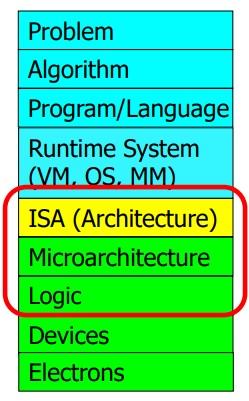
- **example: meltdown & spectre:** speculative execution is doing something before you know it is needed to improve performance but it leaves traces of data in processor's cache, a malicious program can inspect the contents of the cache to infer secret data
- **example: rowhammer:** repeatedly opening & closing a DRAM row (aggressor row) enough times within a refresh interval induces disturbance errors in adjacent rows (victim row) due to electrical interference  
  *"it's like breaking into an apartment by repeatedly slamming a neighbor's door until vibrations open the door you were after"*  
  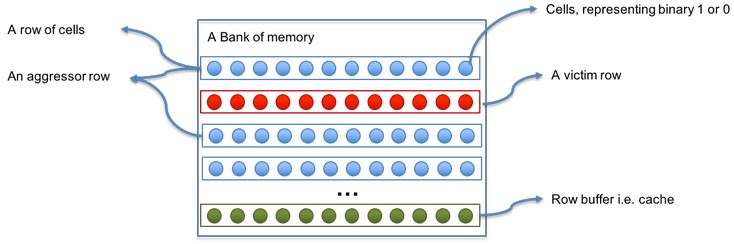
- **example: memory performance attacks:** in a multi-core system to increase throughput DRAM controller services row-hit access first so programs with good memory spatial locality are preferred, DRAM controller vulnerable to denial of service attacks  
  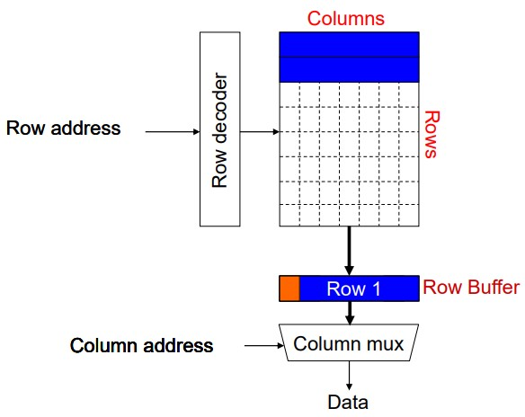
- **example: DRAM refresh:** a DRAM cell consists of a capacitor & an access transistor, data stored in terms of charge status of capacitor but charge leaks over time, memory controller needs to refresh each row periodically to restore charge, increases energy consumption & DRAM bank unavailable while refreshing, only small % have low retention time (manufacturing process variation), check bins to determine refresh rate of a row once profiling (retention time of all DRAM rows) is done  
  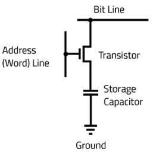
  - **Bloom filter:** memory efficient probabilistic data structure that compactly represents set membership, test set membership using hash functions (unique identifier generator), never false negative & never overflows (but `num elements ∝ false positives rate`)
- **Hamming code:** powers-of-2 bits are regular parity bits used to track the parity of the other bits whose position have a 1 in the same place, 0th message bit used as overall parity, can correct 1-bit errors (regular parity incorrect & overall parity incorrect) & detect 2-bit errors (regular parity incorrect & overall parity correct)  
  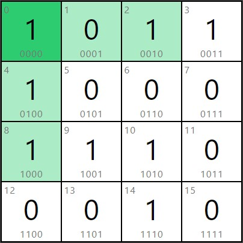
  - **Hamming distance:** number of locations at which two equal-length strings are different
- **field programable gate array (FPGA):** is a reconfigurable substrate (functions, interconnections, I/O) that can be programmed for a specific use, faster than software & more flexible than hardware, programmed using hardware description language (HDL) like Verilog & VHDL  
  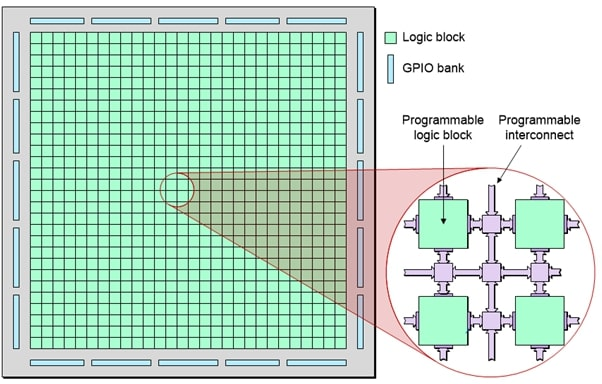
- **iron law of processor performance:** trade-off between complexity and the number of primitive instructions that processors use to perform calculation  
  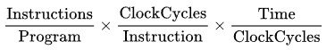
- **Amdahl's law:** overall performance improvement gained by optimizing a single part of a system is limited by the fraction of time that the improved part is actually used  
  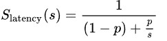  
  `Slatency` theoretical speedup  
  `s` speedup of optimized part  
  `p` fraction of time

## combinational logic
- **combinational logic:** output strictly dependent on current inputs (memoryless)
- **duality:** replace `OR` ⟷ `AND` & `0` ⟷ `1`
- **De Morgan's law:**
  ```cpp
  ~(X + Y) == ~X · ~Y
  ~(X · Y) == ~X + ~Y
  ```
- **complement:** `~A, ~B, ~C`  
  **literal:** variable or its complement `A, ~A, B, ~B, C, ~C `  
  **implicant:** `AND` of literals `(A · B · ~C), (~A · C)`  
  **minterm:** `AND` of all input's literals `(A · B · ~C), (~A · ~B · C)`  
  **maxterm:** `OR` of all input's literals `(A + B + ~C), (~A + ~B + C)`
- **sum of products form:** sum of all minterms for which output is `1`
- **gray code:** only one bit changes, `00` ⟷ `01` ⟷ `11` ⟷ `10` ⟷ `00`
- **uniting theorem:** eliminate input that can change without changing output
- **karnaugh maps:** group `2^n` number of adjacent `1`s (to eliminate varying literals), to simplify boolean expressions wrap around adjacency, `X` (dont care) can be used as either `1`/`0` for simpler equation  
  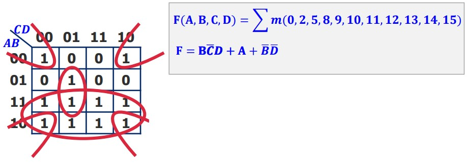
- **multiplexer:** select one of `2^n` inputs & route to single output  
  **demultiplexer:** route single input to one of `2^n` outputs

## sequential logic
- **sequential logic:** output dependent on current & previous inputs (memory)  
- **R-S latch:** if `S == 0` then `Q = 1`, if `R == 0` then `~Q = 1`, if `R == S == 0` then `Q = ~Q = 1`  
  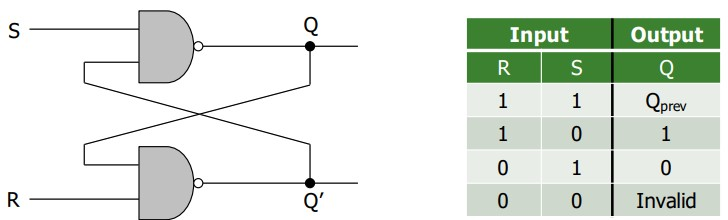
- **gated D latch:** `Q = D` when `write_enable == 1`  
  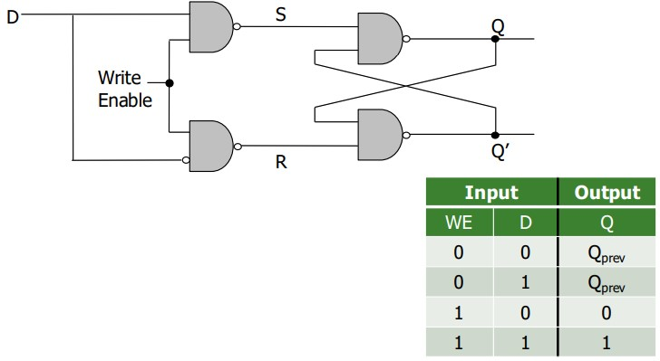
- **D flip flop:** state change only on clock edge & data available full cycle, clock low ⟶ master sends `D` ⟶ clock high ⟶ slave stores `D` in `Q`, so on rising edge `Q = D`  
  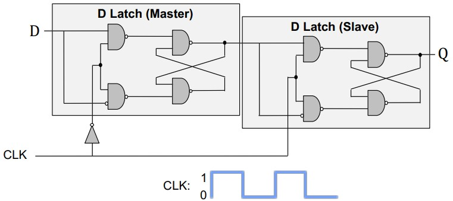
- **finite state machines (FSM):** abstract machine that can be in exactly one of finite states at any given time
  - **Moore:** output depends on current state only
  - **Mealy:** output depends on current input & current state
- **example: snail looking for `1101` pattern:**  
  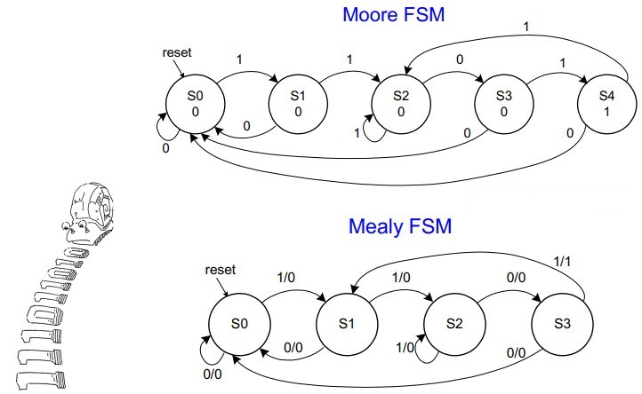

## timing & verification
- **combinational circuit delay:** circuit outputs change some time after the inputs change
- **glitch:** one input transition causes multiple output transitions, visible on K-maps (resolve by adding `~A · C`, ensures no transition)  
  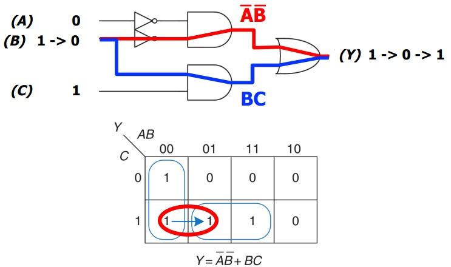

## instruction set architecture
- **instruction:** smallest piece of work in a computer
- **instruction set architecture (ISA):** interface between software & hardware, defines set of instructions supported by the processor
- **data flow model:** instruction fetched & executed when its operands are ready, inherently more parallel  
  **von-neumann model:** stored program (instruction & data memory unified), sequential instruction processing (one instruction processed at a time)
- **instruction cycle:** fetch ⟶ decode ⟶ evaluate address ⟶ fetch operands ⟶ execute ⟶ store result
- **important registers:**
  - **stack pointer (`SP`):** address of top of the stack
  - **link register (`LR`):** return address
  - **program counter (`PC`):** address of current instruction
  - **program status register (`PSR`):** zero (`Z`), negative (`N`), carry (`C`), overflow (`V`)
  - **memory address register (`MAR`):** address to read/write
  - **memory data/buffer register (`MDR`/`MBR`):** data from read/write
- **opcode/instruction:** most can modify PSR flags by postfixing `S`, three types: operate, data movement & control flow
  ```
  AND regd, rega, argb  ; regd ⟵ rega & argb
  EOR regd, rega, argb  ; regd ⟵ rega ^ argb
  SUB regd, rega, argb  ; regd ⟵ rega - argb
  RSB regd, rega, argb  ; regd ⟵ argb - rega, REVERSE SUB
  ADD regd, rega, argb  ; regd ⟵ rega + argb
  ADC regd, rega, argb  ; regd ⟵ rega + argb + C (carry in PSR)
  SBC regd, rega, argb  ; regd ⟵ rega - argb - !C
  RSC regd, rega, argb  ; regd ⟵ argb - rega - !C
  TST rega, argb        ; set flags for rega & argb, result discarded, TEST
  TEQ rega, argb        ; set flags for rega ^ argb, result discarded, TEST_EQUIVALENCE
  CMP rega, argb        ; set flags for rega - argb, COMPARE
  CMN rega, argb        ; set flags for rega + argb, COMPARE_NEGATIVE
  ORR regd, rega, argb  ; regd ⟵ rega | argb
  MOV regd, arg         ; regd ⟵ arg
  BIC regd, rega, argb  ; regd ⟵ rega & ~argb, BIT_CLEAR
  MVN regd, arg         ; regd ⟵ ~argb, MOV_NOT
  B target_addr         ; BRANCH
  LDR regd, [rega]      ; regd ⟵ *rega, LDRB for 8bit
  STR regd, [rega]      ; regd ⟶ *rega, STRB for 8bit
  ```
- **condition flags:**
  ```
  EQ          equal                         Z
  NE          not equal                     !Z
  MI          minus/negative                N
  PL          plus/positive or zero         !N
  VS          overflow set                  V
  VC          overflow clear                !V
  GE          signed greater than or equal  N == V
  LT          signed less than              N != V
  GT          signed greater than           !Z && (N == V)
  LE          signed greater than or equal  Z || (N != V)
  AL/omitted  always                        true
  ```

**addressing modes:**
1. **immediate offset:** `[Rn, #±imm]` offset to address in `Rn`
2. **register:** `[Rn]` address in `Rn` (same as `[Rn, #0]`)
3. **scaled register offset:** `[Rn, ±Rm, shift]` address is sum of `Rn` value & shifted `Rm` value
4. **register offset:** `[Rn, ±Rm]` address is sum of `Rn` & `Rm` values (same as `[Rn, ±Rm, LSL #0]`)
5. **immediate pre-indexed:** `[Rn, #±imm]!` same as immediate offset but `Rn` set to address
6. **scaled register pre-indexed:** `[Rn, ±Rm, shift]!` same as scaled register offset mode but `Rn` set to address
7. **register pre-indexed:** `[Rn, ±Rm]!` same as register offset mode but `Rn`set to address
8. **immediate post-indexed:** `[Rn], #±imm` same as register then offset added to `Rn`
9. **scaled register post-indexed:** `[Rn], ±Rm, shift` same as register then shifted `±Rm` value added to `Rn`
10. **register post-indexed:** `[Rn], ±Rm` same as register then `±Rm` added to `Rn` (same as `[Rn], ±Rm, LSL #0`)

**shift flags:** used with addressing modes
1. **logical shift left (`LSL`):** `a << b`
2. **logical shift right (`LSR`):** `a >> b`
3. **arithematic shift right (`ASR`):** `a >> b` with sign extension, `ASL == LSL`
4. **rotate right (`ROR`):** `a >> b` with wrap around

**example: loop C to assembly:**
```cpp
// C ⟶ Assembly
// C
int total;
int i;

total = 0;
for (i = 10; i > 0; i--)
{
    total += i;
}

// ARM Assembly
        MOV  R0, #0
        MOV  R1, #10
again   ADD  R0, R0, R1
        SUBS R1, R1, #1 ;
        BNE  again      ; // check Z flag
halt    B    halt       ; // infinite loop
        END
```

**example: strcpy in assembly:**
```cpp
// ARM Assembly strcpy()
strcpy  LDRB R2, [R1], #1
        STRB R2, [R0], #1
        TST R2, R2        ; repeat if R2 is nonzero
        BNE strcpy
        END
```