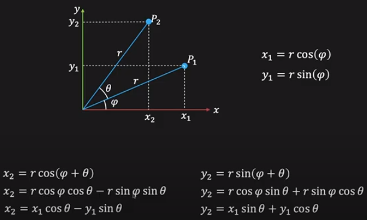
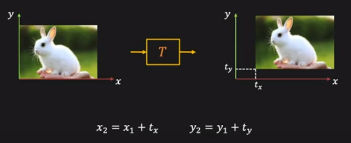

## [Computer Architecture](./computerarchitecture.md)

## [Computer Vision](./computervision.md)

## [C++](./cpp.md)

## [Maths](./maths.md)

## [Misc](./misc.md)

## [Operating Systems](./operatingsystem.md)

## [Optimization](./optimization.md)

## Symbols

```sh
±               # plus minus
:               # such that
∀               # for all
∴               # therefore
∵               # since
⊂               # subset of
∈               # belongs to
∪               # union
⇒               # implies that
⇔               # if and only if
≈               # approximately equal
≡               # equivalent
∝               # proportional
∞               # infinity
⟵ ⟶ ⟷ ↑ ↓   # arrows
×               # multiply
∠               # angle
°               # degree
∆               # delta
∑               # sigma
·               # dot product
α               # alpha
β               # beta
γ               # gamma
δ               # delta
ε               # epsilon
θ               # theta
κ               # kappa
λ               # lambda
μ               # mu
π               # pi
σ               # sigma
τ               # tau
φ               # phi
ψ               # psi
ω               # omega
⦻              # correlation
∗               # convolution
                # invisible character
```


# CLEANUP

## CA

- [Memory Layout](https://stackoverflow.com/questions/38909811/how-does-the-global-variable-declaration-solve-the-stack-overflow-in-c)
- [Cache](https://youtu.be/9nuAjYRbITQ?t=16726)
- [dynamic loading *.so](https://en.wikipedia.org/wiki/Dynamic_loading)
- [OoO execution](https://www.youtube.com/watch?v=Nsf2_Au6KxU)
  - [PDF](http://media.steampowered.com/apps/valve/2015/Migdalskiy_Sergiy_Physics_Optimization_Strategies.pdf)
- [stack overflow protection](https://en.wikipedia.org/wiki/Buffer_overflow_protection)
- [Context switch](https://stackoverflow.com/questions/6605581/what-is-the-context-switching-mechanism-in-gpu)
- stack overflow
- [spiral rule](https://riptutorial.com/c/example/18833/using-the-right-left-or-spiral-rule-to-decipher-c-declaration)
- [shared mem](https://www.geeksforgeeks.org/posix-shared-memory-api/)
- [socket programming](https://www.geeksforgeeks.org/socket-programming-cc/)

- **D**irect **M**emory **A**ccess
  - access memory independent of CPU
  - CPU receives signal once DMA is done
  - **modes** how DMA get control over system bus
    - **burst** entire block transferred
    - **cycle stealing** interleave control with CPU
    - **transparent** control when CPU not using bus
- **prefetch**
  - fetch data ahead of demand
  - **too early** clutter storage/gets thrown out before used
  - **too late** defeats purpose
  - 
- addressing
  - **physical** access hardware addresses of physical RAM
  - **virtual** kernel divides addresses into pages, process mapped to pages (VAS), when process access page, translation from virtual to phys addr
      - if mapped to phys mem, run instruction
      - not mapped (page fault), find free/alloc page, rerun instruction
      - **guard page** alarm when accessed (if process memory grows indefinitely)
**segmentation fault** attempt to access memory/in a way not allowed, dereference `NULL`/wild/dangling pointers, 
  - access outside process address space
  - write read-only mem (code segment)
  - return pointer overwritten due to buffer overflow (buffer on stack)

### Cache
- store repeated use data on CPU die (but costly)
- closer to CPU (less latency), SRAM faster > DRAM
  - on chip bandwidth higher (smaller wires)
- **S**tatic **RAM** (transistors, const power, cache) vs **D**ynamic **RAM** (capacitors, refreshed (downtime), main memory)
- **cache-hit** data available, **miss** access from main memory
  - **cold cache** empty/irrelevant data, **hot** relevant data
- **reference patterns**
  - **temporal locality** same location fetched again
  - **spatial locality** nearby location fetched next
  - exploit both by remembering recent content & fetch nearby locations
  - 
- **basic cache algorithm**
  - 
  - processor load request ⟶ check valid cache tag ⟶ if cache-hit use data ⟶ cache-miss read block from main memory & add to cache (use data in parallel)
- **associativity** map main memory to cache
  - **direct** map to respective cache line
    - `block_num % cache_size`
    - 
      - `index` 2 bits here, `v` valid flag (invalidate)
  - **fully associative** map to any free cache line
    - if not free, replacement algo
  - **k-way associative** combo of first two, map to `k` set of cache lines (any free in that set)
    - within each set, replacement algo
    - `block_num % k`
      - if `k == 1` direct
      - if `k == numCacheLines` fully associative
    - 
    - `index` which set, search both lines using `tag`
- **block replacement**
  - no choice in direct mapped (only 1 cache line)
  - **L**east **R**ecently **U**sed
    - cache state updated on every access
  - **F**irst **I**n **F**irst **O**ut
    - for higly associative caches
  - **N**ot **M**ost **R**ecently **U**sed
    - FIFO except most recently used blocks
- **write strategy** write output back
  - **write-through**
    - written to cache & memory at same time
    - signal once both done
    - multi-threaded application
  - **write-back**
    - written to cache
    - memory written only when cache evicted (if dirty bit set)
    - used for frequent read & write
    - stale data to other thread possible
- **coherence**
  - same data across multiple local caches
  - **flush** copy all cached data to DRAM
  - **invalidate** set any cached data from that memory as invalid, future reads go to DRAM
- **cache performance**
  - `access time = hit time + miss_rate * miss_penalty`
  - **misses**
    - **compulsary** first ever reference to block
    - **capacity** cache too small, unable to hold all data needed by program
    - **conflict** repeated access part of memory mapped to same set (k-way associative)
  - reduce hit time
      - smaller cache, lower tag overhead, lower `hit time`
  - reduce miss rate
    - larger block size
      - low tag overhead exploit data bursts but maybe data not used, fewer block more conflicts
    - larger cache size
      - higher tag overhead


## CV

- [lectures list](https://github.com/kuzand/Computer-Vision-Video-Lectures)
- [UWash (2018)](https://www.youtube.com/playlist?list=PLjMXczUzEYcHvw5YYSU92WrY8IwhTuq7p)
- [Shree Nayar](https://fpcv.cs.columbia.edu/)
- [Harris Corner Detector PDF](http://www.cs.cmu.edu/~16385/s17/Slides/6.2_Harris_Corner_Detector.pdf)
- [EPIR & STV](https://www.cs.cmu.edu/~16385/s17/Slides/13.1_Stereo_Rectification.pdf)

### Intro

**HSV** hue ≡ dominant color, saturation ≡ color intensity (`== 0` white), value ≡ color brightness (`== 0` black)  

**YUV** Y luminance, UV chroma  
**NV12** image with luminance & chroma in different planes  
  

**histogram** number of pixels for each intensity value  
**hist equalization** spread out most frequent values, improve contrast  
```
cum_freq = sum of frequencies less than
cum_prob = cum_freq/total_samples
dst = img * cum_prob
```
  


### Resizing

**nearest neighbor** `nn(x, y, z) = img(round(x), round(y), z)`  

**bilinear interpolation** input pixels (`Q11`, `Q12`, `Q21`, `Q22`) ⟶ horizantal values (`P1`, `P2`) ⟶ final pixel (`P`)  
  


### Convolution

**padding** zero/max padding, clamp, mirror  

**seperable** if kernel rows multiple of each other, `2n` ops instead of `n*n`  
  

**low pass** suppress high freq i.e. rapid changes (smoothing)  
**high pass** enhance high feq (edge detection, sharpen)  


### Smoothing

used as preprocessing to reduce artifacts (staircase pattern in downscaling)  

**box** average/mean  
```
        [ 1   1   1 ]
1/9  ×  [ 1   1   1 ]
        [ 1   1   1 ]
```

**median** not affected by single very unrepresentative pixel, more robust but more computations  

**Gaussian** nearby pixels get higher weight  
  
float slower (needs FPU), so `[ 1 2 1 ]` binomial filter (approx to gaussian `σ == ~0.85`)  
```
          [ 1   2   1 ]
1/16  ×   [ 2   4   2 ]
          [ 1   2   1 ]
```


### Edge Detection

rapid changes, detected using derivative  
  
```
forward     f(x+1)  - f(x)            [ 0  -1   1 ]
backward    f(x)    - f(x-1)          [-1   1   0 ]
central     f(x+1)  - f(x-1)          [-1   0   1 ]
```
central used, symmetric across pixel  

**smooth ⟶ central**, reduce false-positives due to noise  

**Prewitt** `central × box`  
```
                  [ 1   1   1 ]     [-1   0   1 ]
[-1   0   1 ]  ×  [ 1   1   1 ]  =  [-1   0   1 ] 
                  [ 1   1   1 ]     [-1   0   1 ]
```

**Sobel** `central × gaussian`  
```
                  [ 1   2   1 ]     [-1   0   1 ]
[-1   0   1 ]  ×  [ 2   4   2 ]  =  [-2   0   2 ] 
                  [ 1   2   1 ]     [-1   0   1 ]
```

**Lapalacian** double derivative, both X & Y edges at once, zero crossing is edge  
  
  
```
// laplacian = fxx + fyy
// kernels zero padded
[ 0   0   0 ]     [ 0   1   0 ]     [ 0   1   0 ]
[ 1  -2   1 ]  +  [ 0  -2   0 ]  =  [ 1  -4   1 ]
[ 0   0   0 ]     [ 0   1   0 ]     [ 0   1   0 ]
```

**LoG** Laplacian of Gaussian, 2nd derivative of Gaussian equation  

**DoG** Difference of Gaussian, approx of LoG  
  

**Canny**  
1. **smooth**  
2. **gradient** `mag = sqrt(Ix^2 + Iy^2)` & `dir = arctan(Iy/Ix)`  
3. **non-max suppression** strongest pixels across gradient (perpendicular to edge)  
  
  
4. **thresholding**  
```
T, t        : two thresholds
I           : edge

I > T       : strong edge
T > I > t   : weak edge
I < t       : not edge
```
5. **connect** strong edges ∈ edges & weak edges ∈ edges ⇔ strong 8 neighbor  


### Transformations

**image filtering** change range (brightness)  
**image warping** change domain (location)  
  

**scaling**  
```
x2= a × x1
y2= b × y1

T  =  [ a 0 ]
      [ 0 b ]
```

**rotation**  
  
```
T = [ cosθ -sinθ ]
    [ sinθ  cosθ ]
```

**skew**  
  
```
// horizontal 
T = [ 1   mx ]
    [ 0    1 ]

// vertical 
T = [ 1    0 ]
    [ my   1 ]
```

**mirror**  
  
```
// about Y axis 
T = [-1   0 ]
    [ 0   1 ]

// about y=x line 
T = [ 0   1 ]
    [ 1   0 ]
```

**homogenous coordinates** 3D representation of a 2D point, third coord (`z~ != 0`) fictitious  
  
all homo coords lies on the yellow line (`p` lies on `z~ == 1` plane)  
```
p   = (x, y)
p~  = (x~, y~, z~)

x = x~ / z~
y = y~ / z~
```

**2x2 ⟶ homo coords**  
```
// append this
[       0 ]
[       0 ]
[ 0  0  1 ]
```

**translation**  
  
```
    [ 1   0   tx ]
T = [ 0   1   ty ]
    [ 0   0   1  ]
```

**composition** multiply transformations in sequence then apply  

**affine transformations** all transformations till now are affine, image opposite edges parallel, last row always `[ 0 0 1 ]`  
```
[ x2 ]    [ x2~ ]   [ a11   a12   a13 ]   [ x1~ ]
[ y2 ] =  [ y2~ ] = [ a21   a22   a23 ] × [ y1~ ]
[  1 ]    [ z2~ ]   [   0     0     1 ]   [ z1~ ]
```

**projective/perspective transformations/homography** maps one plane to another through a point, same as imaging a plane through a pinhole  
  
  
```
[ h11   a12   a13 ]
[ h21   a22   a23 ]
[ h31   h32   h33 ]
```


### Features

unique highly descriptive regions  
**keypoint** point in image  
**descriptor** vector that describes keypoint surrounding  

**sum squared difference** how close are two regions `Σ ((I(x, y) - J(x, y)) ^ 2)`  
  - compare to every other region, computationally intensive  
  - **self difference** compare to shifted version of itself `Σ ((I(x,y) - I(x+dx, y+dy)) ^ 2)`  
  
  
  


### Harris Corner Detector

1. **gradient**(`Ix` & `Iy`)  
  

2. **covariance matrix**  
  

3. **eigen values**  
  
```cpp
determinant(M) = λ1 * λ2
trace(M) = λ1 + λ2

R = det(M) - k * (trace(M)^2) // Harris Reponse Function, k ∈ [0.04, 0.06]  
```

4. **threshold** `R` to get strong corners  
  

5. **non-max suppression** reduce duplicate features  
slide window across image ⟶ retain `if(centerpix == max)` ⟶ `else` supress  


### Random Sample Consesus

trial & error approach for dealing with data with outliers (black lines)  

1. randomly choose `s` samples, treat them as inliers  

2. fit the model to chosen `s` samples  

3. count number of data points that fit the model (within measure of error `e`)  

4. repeat steps `N` times (`break if(numInliers > cutoff)`, to reduce computations)  

5. choose model with largest number of inliers  

**example** line fitting (`s == 2`)  
  
  
  


### Histogram of Gradients

better image descriptor than pixel values, uses both mag & dir, dir remains same in different light  

1. compute gradient mag & dir for each pixel  

2. take `n × n` size tiles  

3. each tile split into `8` angular bins (`45° each`), `n^2` values reduced to `8`  
  
  

**principal angle** bin with highest frequency  


### Scale Invariant Feature Transform

both keypoints & descriptors (rotation invariant), describe local area  

1. only for corner points  

2. apply Gaussians (different `σ`s) & calculate DoGs on different scales (image pyramid)  
  

1. find extremum (3D zero crossing) in every 3x3x3 grid (26 neighbors)  
  

1. remove weak responses (thresholding)  
blob size depends on image pyramid level  
  

1. descriptor using HOG (using subwindows)  
  


### Lucas Kanade Optical Flow

measure of movement (object/camera) for certain features (sparse)  

1. moving object to right same as moving observed pixel to left  
  

2. derivation  
```
f(p - Δp, t) = f(p, t + Δt)

// approx taylor expansion (nth order polynomial)
f(x) = Σ ai × x^i
for i = 1 (approx it to line)
f(x) = a1 × x^1 + a0 × x^0

f(p - Δp, t)                 = f(p, t + Δt)
m × (p - Δp) + b             = f(p, t + Δt)
m × p - m × Δp + b           = f(p, t + Δt)

// substract f(p, t) from both sides
m × p - m × Δp + b - f(p, t) = f(p, t + Δt) - f(p, t)

// f(p, t) = mp + b, from taylor exp
- m × Δp                     = f(p, t + Δt) - f(p, t)

// - m × movement = change in brightness from one image to next
// m = slope/gradient = dp = [ dx   0 ]
//                           [  0  dy ]
-dpΔp                        = f(p, t + Δt) - f(p, t)
-dxΔx - -dyΔy                = f((x,y), t + Δt) - f((x,y), t)
```

3. equation cleanup  
  
  

4. but 2 unknowns (`u` & `v`) 1 equation, so assume `8` neighbors move together
so we get 2 unknowns 9 equations  
  
  

5. do this for corners only (same reasons as feature matching)  

**fails when**  
  - lighting changes  
  - large movement (edges can give high translation)  
  - no good features (blank wall)  

**image pyramids** improve performance & robustness of tracking over larger translations  
  


### Stereo Vision

feature matching, displacement inversely proportional to distance from camera


### Epipolar Geometry

  

origin is pinhole, image is virtual image, so origin behind image  
  

**epipole** origin of one camera mapped onto second camera (`el` & `er`)  

**epipolar plane** plane formed by epipoles & point  

**epipolar line** intersection line of epipolar plane with the image plane (`er` to `ur` & `el` to  `ul`)  

**epipolar constraint**  
```
n = t × xl          // vector normal to epipolar plane
xl . (t × xl)  = 0  // dot product of perpendicular lines 0
```
  

**rectification** make epipolar lines matching the horizontal scan lines of image, epipolar lines horizontal ⟶ epipoles at infinity   
  

**why** for each pixel ⟶ find epipolar line ⟶ scan line for best match ⟶ compute disparity (2D to 1D) 
  

**how** reproject planes onto common plane  
  


#### NEON
- extends ARM pipeline
- single thread SIMD
- 16 × 128 bit registers
- data types : `U8`, `U16`, `U32`, `U64`
  - `U` unsigned, `S` signed, `I` unspecified, `F` float(only 16 & 32)
- **optimizing for auto vectorization**
  - simple multiple loops
  - avoid breaks & conditions
  - num iterations power of 2 (remaining iterations in seperate loop)
  - functions inside loop inlined
  - `restrict` pointers do not reference overlapping memory
- **optimization intrinsics**
  - remove dependency on previous vector output (dont reuse same vectors)
- **APIs**
  - `VLD1, VLD2, VLD3, VLD4` interleave load (`VST1`)
    - `VLD1_LANE` load one element
    - `VGET_LANE` get element (`VSET_LANE`)
  - `VREINTERPRET` reinterpret vector
  - `VCOMBINE` combine 64 bit to 128 bit
  - `VGET_HIGH` higher half og 128 bit vector (`VGET_LOW`)
  - `VADD` add 64 + 64 ⟶ 64 (`VADDL` 64 + 64 ⟶ 128, `VADDW` 64 + 128 ⟶ 128)
    - `VQADD` saturate if overflow
    - `VHADD` add then half output 64 + 64 ⟶ 64 (`VRHADD` rounding add)
  - `VMUL` multiply 64 × 64 ⟶ 64
  - `VMLA` multiply accumulate 64 × 64 + 64 ⟶ 64 (`VMLS`)
  - `VMLA_LANE` only one lane
  - `VMUL_N` multiply each element with scalar
  - `VPADD` pairwise add & combine vectors 64, 64 ⟶ 64
  - `VPMAX` pairwise max & combine (`VPMIN`)
  - `VMAX` lanewise max (`VMIN`)
  - `VABS` absolute
  - `VNEG` negate
  - `VCLS` lanewise count consecutive bits (`VCLZ`)
  - `VCNT` lanewise count set bits
  - `VRECPE` reciprocal
  - `VCEQ` lanewise set all ones if equal (`VCGT`, `VCGE`, `VCLT`, `VCLE`)
  - `VAND` bitwise AND (`VORR`, `VEOR`)
  - `VBIC` bitwise clear first vector depending on bits in second vector
  - `VSHL` shift elements in first vector amount in second vector (`VSHL_N`, `VSHR`)
  - `VEXT` lower n elements from second vector, other from first
  - `VZIP` interleave elements of two vectors (`VUZP`)
  - `VCREATE` create vector from 64 bit pattern
  - `VDUP_N` copy value to all elements (`VDUP_LANE`)


## DSA
### String

**basic reversal**  
```cpp
void reverseString1(char *str)
{
    uint8_t length = strlen(str);

    char *temp = (char *)malloc(length + 1);

    for (int i = 0; i < length; i++)
    {
        temp[length - (i + 1)] = str[i];
    }
    temp[length] = 0; // not really needed

    memcpy(str, temp, length + 1);

    free(temp);
}
```

**swap reversal**  
```cpp
void reverseString2(char *str)
{
    uint8_t length = strlen(str);

    for (int i = 0; i < ((length + 1)/2); i++)
    {
        char temp = 0;
        temp = str[length - (i + 1)];
        str[length - (i + 1)] = str[i];
        str[i] = temp;
    }
}
```


### Sort

**bubble sort** compares adjacent elements, if wrong order swap them, every pass last index largest element  
```cpp
static void swap(uint8_t *a, uint8_t *b)
{
    uint8_t temp = *a;
    *a = *b;
    *b = temp;

    return;
}

void bubbleSort(uint8_t *array, uint8_t n)
{
    for (int i = 0; i < (n - 1); ++i)
    {
        for (int j = 0; j < (n - i - 1); ++j)
        {
            if(array[j] > array[j+1])
            {
                swap(&array[j], &array[j+1]);
            }
        }
    }

    return;
}
```


### Linked List

**init**  
```cpp
typedef struct linked_list
{
    uint8_t value;
    linked_list *next;
} linked_list;

int main(void)
{
    linked_list head, middle, tail;

    head.value = 10;
    head.next = &middle;

    middle.value = 20;
    middle.next = &tail;

    tail.value = 30;
    tail.next = NULL;

    return 0;
}
```

**traversal**  
```cpp 
void printLL(linked_list *head)
{
    linked_list *current = head;

    while (current != NULL)
    {
        printf("%d\n", current->value);
        current = current->next;
    }
}
```


### Stack

```cpp
typedef struct stack
{
    uint8_t data[MAX_SIZE];
    int16_t top = -1;
} stack_t;

void push(stack_t *f_stack, uint8_t num)
{
    if (f_stack->top < MAX_SIZE)
    {
        ++(f_stack->top);
        f_stack->data[f_stack->top] = num;
    }
    else
    {
        printf("stack full\n");
    }
}

void pop(stack_t *f_stack)
{
    if (f_stack->top >= 0)
    {
        f_stack->data[f_stack->top] = NULL;
        --(f_stack->top);
    }
    else
    {
        printf("stack empty\n");
    }
}

void peek(stack_t *f_stack)
{
    if (f_stack->top >= 0)
    {
        printf("%d %u\n", f_stack->top, f_stack->data[f_stack->top]);
    }
    else
    {
        printf("stack empty\n");
    }
}

int main(void)
{
    stack_t l_stack;
    push(&l_stack, 10);
    push(&l_stack, 20);
    push(&l_stack, 30);
    peek(&l_stack);       // 2 30
    pop(&l_stack);
    peek(&l_stack);       // 1 20
    pop(&l_stack);
    peek(&l_stack);       // 0 10
    pop(&l_stack);      
    pop(&l_stack);        // stack empty
    pop(&l_stack);        // stack empty

    return 0;
}
```


## OCL
- [Convolution Optimization](https://www.evl.uic.edu/kreda/gpu/image-convolution/)
- [Offline Compilation](http://logan.tw/posts/2014/11/22/pre-compile-the-opencl-kernel-program-part-2/)
- **memory model**
  - 
  - `__global`, `__local`, `__constant`, `__private`
  - explicit memory management, user responsible for moving data
- **host side**
  - **context** multiple devices, multiple command queues
  - **program** build kernel code `clCreateProgramWithSource`
    - for offline compilation store compiled binaries (`-save-temps` for asm files)
    - online compilation not safe, share source code `clCreateProgramWithBinary`
  - **commands** kernel execution, sync, memory operations
  - **command queue** points to single device
- **basic**
  1. define platform + devices + context + queue
  2. create & build program (`clGetProgramBuildInfo` for log info)
  3. setup memory objects
  4. define kernel args
  5. enqueue commands (`clEnqueueNDRangeKernel` enqueue execution, `clFinish` blocking execution wait, `clWaitForEvents` blocking wait for signal)
      - profiling using start & end of event `clGetEventProfilingInfo`
- **sync device side**
  - no sync between work groups (split code & use `clFinish` for sync)
  - `barrier()` wait till all work items reach this (ALL or NONE of workitems enter condition)
  - `mem_fence()` make load/store of current thread before fence available to other work items (similar to cache flush)
  - atomic for counters
    - ```cpp
      __global int counter = 0;
      atomic_inc(&counter);
      ```
- **memory objects**
  - **buffers** 1D array, accessed in device like a pointer
  - **image2D** 2D array, access using `read_imageui` & `write_imageui`
    - reading needs sampler `__constant sampler_t sampler = CLK_NORMALIZED_COORDS_FALSE | CLK_ADDRESS_CLAMP_TO_EDGE | CLK_FILTER_LINEAR;`
    - might be saved as z curve (nearby pixels stored linearly)
      - 
    - might cache read only buffer
- **vectors**
  - supported in kernel code
    - ```cpp
      int4 vi1 = (int4) (0, 1, 2, 3);
      vi0 += vi1;
      ```
- **optimization**
  - **memory coalescing**
    - thread `i` access `data[i]`, while `j` access `data[j]`
  - **RGBA convolution**
    - **naive**
      - ```cpp
        __kernel void convolute(
          const __global float * input, 
          __global float * output,
          __global float * filter 
        )
        {

          int rowOffset = get_global_id(1) * IMAGE_W * 4;
          int my = 4 * get_global_id(0) + rowOffset;
          
          int fIndex = 0;
          float sumR = 0.0;
          float sumG = 0.0;
          float sumB = 0.0;
          float sumA = 0.0;
          
            
          for (int r = -HALF_FILTER_SIZE; r <= HALF_FILTER_SIZE; r++)
          {
            int curRow = my + r * (IMAGE_W * 4);
            for (int c = -HALF_FILTER_SIZE; c <= HALF_FILTER_SIZE; c++, fIndex += 4)
            {
              int offset = c * 4;
                
              sumR += input[ curRow + offset   ] * filter[ fIndex   ]; 
              sumG += input[ curRow + offset+1 ] * filter[ fIndex+1 ];
              sumB += input[ curRow + offset+2 ] * filter[ fIndex+2 ]; 
              sumA += input[ curRow + offset+3 ] * filter[ fIndex+3 ];
            }
          }
          
          output[ my     ] = sumR;
          output[ my + 1 ] = sumG;
          output[ my + 2 ] = sumB;
          output[ my + 3 ] = sumA;
          
        }
        ```
    - **`__constant`** for kernel
      - ```cpp
        __kernel void convolute(
          const __global float * input, 
          __global float * output,
          __constant float * filter 
        )
        ```
    - **`float4`**
      - use vector mult to convolve 4 channels at once
    - **loop unrolling**
      - useful when small loops (loop overhead significant)
      - useless here
    - **macros**
      - pass sizes as compile time macros 
    - **local mem**
      - each pixel in tile copies one value, edge pixels copy extra values
      - 


## OS
### Intro
- intermediate b/w hardware and software
  - hide hardware complexity
  - handles resource management 
  - provide isolation and protection
- **elements**
  - **abstractions** process, thread, file, socket, memory page
  - **mechanisms** create, schedule, open, write, allocate
  - **policies** LRU, LFU
- 

### Process Management
- **process** instance of application
- **P**rocess **C**ontrol **B**lock
  - created when process is created
  - updated when state changes
  - 

### Context Switching
- switch from one process to another (copy new PCB from disk to DRAM)
- costs
  - **direct** load/store
  - **indirect** cold cache
- sometimes have to switch (higher priority, timesharing)

### Lifecycle
- 

### Creation
- **fork** copy parent PCB into new child PCB (continues from parent Program Counter)
  - `<unistd.h>`
  - ```
    int main()
    {
        printf("Hello 1\n");    // Hello 1
        fork();
        printf("Hello 2\n");    // Hello 2
                                // Hello 2
        return 0;
    }
    ```
- **exec** create child PCB (start from first instruction)
  - `int execv(const char *path, char *const argv[]);`

### CPU Scheduler
- which one of ready processes dispatched to start running & for how long it should run
  - **preempt** interrupt & save current PCB
  - **schedule** choose next process
  - **dispatch** dispatch new process (load new PCB)
- **timeslice** time allocated to process
- **algorithms**
  - **F**irst **C**ome **F**irst **S**erve
    - FIFO queue
    - high wait time
  - **S**hortest **J**ob **F**irst
    - process with shortest execution scheduled next
    - short jobs given priority
  - **R**ound **R**obin
    - each process equal timeshare
  - **P**riority **S**cheduling
    - higher priority executed first
    - same priority - FCFS or RR

### IPC
- **I**nter **P**rocess **C**ommunication
  - transfer data/info between address space
  - maintain protection and isolation
  - provide flexibility and performance
- **linux IPC**
  - **signal** basic signal from kernel/process to other processes (for some `SIGSEV` program terminates)
    - `SIGSEV` segmentation fault
    - `SIGABRT` abort/terminate
    - `SIGCHLD` child process terminates
  - **pipe** connect standard output from one process into standard input of another process
    - `ls | grep opencv`
  - **sockets**
    - **message passing**
      - 
      - OS managed (overhead)
      - write/read to/from channel
    - **shared memory**
      - 
      - OS establishes shared mem & maps into each processes' address space (after init no OS)
      - directly write/read to/from memory (implement code)
    - shared better for higher freq/larger messages

### Threads
- 
- heap shared & protected through mutex
- why
  - **parallelization** speedup
  - **specialization** hot cache (running same code)
  - **efficiency** lower memory requirement (shared mem) & cheaper IPC, so used to hide latency

### pthreads
- **P**ortable **O**perating **S**ystem **I**nterface (portable OS interface)
- link using `-lpthread` or `target_link_libraries(<exe_name> pthread)`
- return & args of subroutine must be `void *`
- **APIs**
  - `ret = pthread_create(&thread, &attr, theadFunc, args);` create thread (`attr == NULL` default)
  - `pthread_exit(&retval);` exit current thread
  - `pthread_join(thread, &&retval);` blocking wait
  - ```cpp
    void *thread1Func(void *ptr)
    { 
        ...
    }

    void *thread2Func(void *ptr)
    { 
        ...
    }

    int main()
    {
        pthread_t thread1;
        pthread_t thread2;
        int ret1, ret2;

        ret1 = pthread_create(&thread1, NULL, thread1Func, NULL);
        assert(ret1 == 0);
        ret2 = pthread_create(&thread2, NULL, thread2Func, NULL);
        assert(ret2 == 0);

        pthread_join(thread1, NULL);          // return 0 successfull
        printf("thread1 returns: %d\n", ret1);

        pthread_join(thread2, NULL);
        printf("thread2 returns: %d\n", ret2);

        return 0;
    }
    ```

### Thread Safety
- **re-entrancy**
  - interrupt function ⟶ interrupt service routine ⟶ continue function
  - save state in local variables
  - atomic operations for shared variables (`static` & `global`)
- **thread-local storage**
  - each thread local copy of shared variables
- **immutable objects**
  - state of object can't be changed after constructor
  - `class` with `private` members set in `constr`
- **atomic operations**
  - access & read/write in single instruction

#### Mutex
- `<pthread.h>`
- **mut**ual **ex**clusion
- **APIs**
  - `pthread_mutex_t g_mutex = PTHREAD_MUTEX_INITIALIZER;` declaration
  - `pthread_mutex_lock(&mutex);` acquire
  - `pthread_mutex_unlock(&mutex);` release
  - `pthread_mutex_init(&mutex, &attr);` init if not in declaration
  - `pthread_mutex_destroy(&mutex);` destroy
- **race condition** multiple threads access same memory
- **resource starvation** thread perpetually denied necessary resources (keep lock for shortest time)
- **deadlock** mutex locked but then not unlocked (locks always in same order) or locking same mutex twice in same thread
- **spinlock** thread waiting for mutex in a loop (busy waiting)
  - ```cpp
    void *thread1Func(void *ptr)
    {
        pthread_mutex_lock(&mutex1); // no issue
        pthread_mutex_lock(&mutex2); // deadlock since thread2 locked
        ...
        // prevent deadlock
        // pthread_mutex_lock(&mutex1);
        // pthread_mutex_lock(&mutex2);
        // ...
    }
    void *thread2Func(void *ptr)
    {
        pthread_mutex_lock(&mutex2); // no issue
        pthread_mutex_lock(&mutex1); // thread1 deadlocked
        ...
        // prevent deadlock
        // pthread_mutex_lock(&mutex1);
        // pthread_mutex_lock(&mutex2);
        // ...
    }
    ```
  - ```cpp
    void *threadFunc(void *ptr)
    {
        pthread_mutex_lock(&mutex); // no issue
        pthread_mutex_lock(&mutex); // deadlock, mutex deadlock
    }
    ```

#### Condition Variables
- `<pthread.h>`
- wait till other thread signals completion (busy wait inefficient)
- **APIs**
  - `pthread_cond_t cond = PTHREAD_COND_INITIALIZER;` decalaration
  - `pthread_cond_wait(&cond, &mutex);` wait
    - unlocks mutex, wait for signal, lock mutex
  - `pthread_cond_timedwait(&cond, &mutex, &waitTime);` timed wait (`struct timespec waitTime`)
  - `pthread_cond_signal(&cond);` notify one waiting thread
  - `pthread_cond_broadcast(&cond);` notify all waiting threads
    - need to wake both threads waiting for `while (x < 10)` & `while (x < 10 || y < 5)` when `x` updated
  - `pthread_cond_init(&cond, &attr);` init
  - `pthread_cond_destroy(&cond);` destroy

##### Producer Consumer problem
- producer appends items to a list (till list is full) then consumer prints all items & clears it
  - ```cpp
    pthread_mutex_t mutex = PTHREAD_MUTEX_INITIALIZER;
    pthread_cond_t cond = PTHREAD_COND_INITIALIZER;
    uint8_t g_arr[10] = {0};
    bool g_arr_filled = false;

    void *producer(void *arg)
    {
        while (1)
        {
            pthread_mutex_lock(&mutex);
            for (int i = 0; i < 10; i++)
            {
                g_arr[i] = i * 10;
            }
            g_arr_filled = true;
            pthread_mutex_unlock(&mutex);
            pthread_cond_signal(&cond);
        }
    }

    void *consumer(void *arg)
    {
        while (1)
        {
            pthread_mutex_lock(&mutex);
            while (g_arr_filled == false)
            {
                pthread_cond_wait(&cond, &mutex);
            }
            for (int i = 0; i < 10; i++)
            {
                printf("%d\n", g_arr[i]);
            }
            g_arr_filled = false;
            sleep(1);
            pthread_mutex_unlock(&mutex);
        }
    }

    int main(int argc, char *argv[])
    {
        pthread_t th[2];

        if (pthread_create(&th[0], NULL, &producer, NULL) != 0)
        {
            perror("Failed to create thread");
        }
        if (pthread_create(&th[1], NULL, &consumer, NULL) != 0)
        {
            perror("Failed to create thread");
        }

        for (int i = 0; i < 2; i++)
        {
            if (pthread_join(th[i], NULL) != 0)
            {
                perror("Failed to join thread");
            }
        }

        return 0;
    }
    ```

#### Sempahore
- `<semaphore.h>`
- mutex owned by a thread, semaphore acquired/released from any thread
  - **binary semaphore** similar to mutex
  - **counting semapore** takes non-negative values
- **APIs**
  - `sem_t semaphore;` declaration
  - `sem_init(&sem, shared, init_value);` create sem (`shared` shared with forked process)
  - `sem_wait(&sem);` acquire
  - `sem_post(&sem);` release
  - `sem_getvalue(&sem, &val);` get value
  - `sem_destroy(&sem);` destroy (wait for pending acquires)
- **semaphore** vs **mutex**
  - signalling mechanism vs locking mechanism
  - signal block completion (sequential pipeline) vs lock critical resource (file, HWAs)
- **priority inversion**
  - occurs when medium priority thread runs ahead of higher priority thread because of lower priority thread holding up critical resource needed by higher priority thread
  - can be prevented if high priority thread transfers its priority to low priority thread