# Computer Architecture

1. [To Do](#to-do)
2. [Links](#links)
3. [Intro](#intro)
4. [Combinational Logic](#combinational-logic)
5. [Sequential Logic](#sequential-logic)
6. [Timing \& Verification](#timing--verification)
7. [Instruction Set Architecture](#instruction-set-architecture)
8. [Microarchitecture](#microarchitecture)
9. [Pipelining](#pipelining)
10. [Out-of-Order Execution](#out-of-order-execution)
11. [Superscalar Execution](#superscalar-execution)

## To Do

- old PPTs, extra info & revise  
- hamming codes
- ARM programming guide
- [branch prediction 1](https://danluu.com/branch-prediction/)
- [branch prediction 2](https://retrocomputing.stackexchange.com/questions/5240/how-does-the-68060-branch-predictor-work/)
- [Heterogenous Computing Systems](https://www.youtube.com/playlist?list=PL5Q2soXY2Zi_OwkTgEyA6tk3UsoPBH737)
- fine grained multithreading
- [Modern Microprocessors](https://www.lighterra.com/papers/modernmicroprocessors/)

## Links

- [Design of Digital Circuits (ETH Zürich, 2018)](https://www.youtube.com/playlist?list=PL5Q2soXY2Zi_QedyPWtRmFUJ2F8DdYP7l)
- [ARM Assembly](http://www.cburch.com/books/arm/)

## Intro

**Bloom filter**  
memory efficient probabilistic data structure that compactly represents set membership  
test set membership using hash functions (unique identifier generator)  
never false negative  
never overflows but `num elements ∝ false positives rate`  

**iron law of processor performance**  
trade-off between complexity and the number of instr  
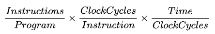  

**Amdahl's law**  
overall performance improvement gained by optimization is limited by the fraction of time that improved part is actually used  
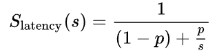  
`Slatency` theoretical speedup  
`s` speedup of optimized part  
`p` fraction of time  

## Combinational Logic

output strictly dependent on current inputs (memoryless)  

**duality**  
replace `OR` ⟷ `AND` & `0` ⟷ `1`  

**DeMorgan's law**  
```cpp
~(X + Y) == ~X · ~Y
~(X · Y) == ~X + ~Y
```

**complement**  
`~A, ~B, ~C`  

**literal**  
variable or its complement `A, ~A, B, ~B, C, ~C `  

**implicant**  
`AND` of literals `(A · B · ~C), (~A · C)`  

**minterm**  
`AND` of all inputs `(A · B · ~C), (~A · ~B · C)`  

**maxterm**  
`OR` of all inputs `(A + B + ~C), (~A + ~B + C)`  

**sum of products form**  
sum of all minterms for which output is `1`  

**uniting theorem**  
eliminate input that can change without changing output  

**gray code**  
only one bit changes, `00` ⟷ `01` ⟷ `11` ⟷ `10` ⟷ `00`  

**Karnaugh maps**  
group `2^n` number of adjacent `1`s ⟶ eliminate varying literals  
to simplify boolean expressions, wrap around adjacency  
`X` (dont care) can be used as either `1`/`0` for simpler equation  
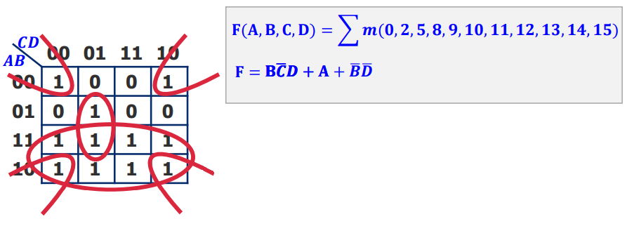  

**multiplexer**  
select one of `2^n` inputs & route to single output  

**demultiplexer**  
route single input to one of `2^n` outputs  

## Sequential Logic

output dependent on previous & current inputs (memory)  

**R-S latch**  
if `S == 0` then `Q = 1`, if `R == 0` then `~Q = 1`  
if `R == S == 0` then `Q = ~Q = 1`  
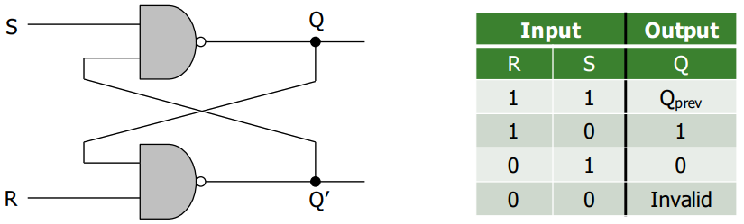  

**gated D latch**  
`Q = D` when `WE == 1`  
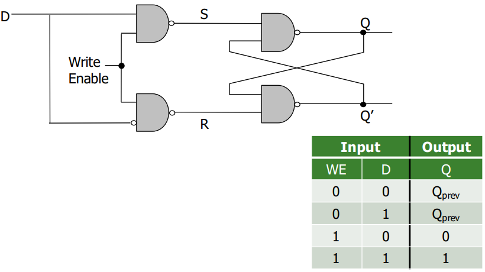  

**D flip flop**  
state change only on clock edge & data available full cycle  
clock low, master sends `D` ⟶ clock high, slave stores `D` in `Q`, *i.e.* rising edge `Q = D`  
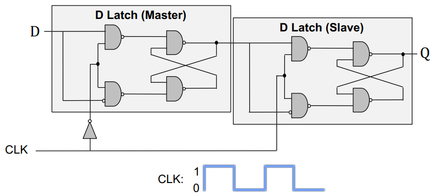  

**FSM**  
Finite State Machines  
discrete time model of system  
  1. **Moore**  
  output depends on current state  
  2. **Mealy**  
  output depends on current state & current input  
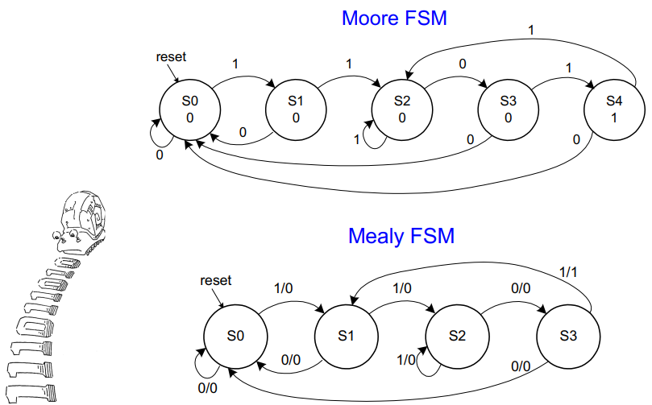  

## Timing & Verification

**combinational circuit delay**  
output doesn't change instantaneously with input  

**glitch**  
one input transition causes multiple output transitions  
visible on K-maps (resolve by adding `~A · C`)  

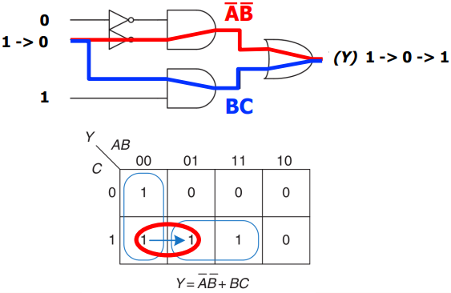  

## Instruction Set Architecture

interface between SW & HW, defines set of instructions supported by the processor  

**data flow model**  
instr fetched & executed when its operands are ready, inherently more parallel  

**von Neumann model**  
stored program (intr & data memory unified), sequential instr processing, *i.e.* one instr processing at a time  

**instruction cycle**  
fetch ⟶ decode ⟶ evaluate addr ⟶ fetch operands ⟶ execute ⟶ store result  

**`SP`**  
Stack Pointer  
addr of top of stack  

**`LR`**  
Link Register  
return addr  

**`PC`**  
Program Counter  
addr of current instr  

**`PSR`**  
Program Status Register  
`Z` zero, `N` negative, `C` carry, `V` overflow  

**`MAR`**  
Memory Address Register  
addr to read/write  

**`MDR`**/**`MBR`**  
Memory Data/Buffer Register  
data from read/write  

**opcode**/**instruction**  
most can postfix `S` to modify PSR flags  
  1. operate  
  2. data movement  
  3. control flow  
```
AND regd, rega, argb    ; regd ⟵ rega & argb
EOR regd, rega, argb    ; regd ⟵ rega ^ argb
SUB regd, rega, argb    ; regd ⟵ rega - argb
RSB regd, rega, argb    ; regd ⟵ argb - rega, REVERSE SUB
ADD regd, rega, argb    ; regd ⟵ rega + argb
ADC regd, rega, argb    ; regd ⟵ rega + argb + carry
SBC regd, rega, argb    ; regd ⟵ rega - argb - !carry
RSC regd, rega, argb    ; regd ⟵ argb - rega - !carry
TST rega, argb          ; set flags for rega & argb, result discarded, TEST
TEQ rega, argb          ; set flags for rega ^ argb, result discarded, TEST EQUIVALENCE
CMP rega, argb          ; set flags for rega - argb, COMPARE
CMN rega, argb          ; set flags for rega + argb, COMPARE NEGATIVE
ORR regd, rega, argb    ; regd ⟵ rega | argb
MOV regd, arg           ; regd ⟵ arg
BIC regd, rega, argb    ; regd ⟵ rega & ~argb, BIT CLEAR
MVN regd, arg           ; regd ⟵ ~argb, MOV NOT
B                       ; BRANCH
LDR regd, [rega]        ; regd ⟵ *rega, LDRB for 8bit
STR regd, [rega]        ; regd ⟶ *rega, STRB for 8bit
```

**condition flags**  
```
EQ              equal                           Z
NE              not equal                       !Z
MI              minus/negative                  N
PL              plus/positive or zero           !N
VS              overflow set                    V
VC              overflow clear                  !V
GE              signed greater than or equal    N == V
LT              signed less than                N != V
GT              signed greater than             !Z && (N == V)
LE              signed greater than or equal    Z || (N != V)
AL/omitted      always                          true
```

**addressing modes**  
  1. **immediate offset**  
  `[Rn, #±imm]` offset to addr in `Rn`  
  2. **register**  
  `[Rn]` addr in `Rn` (same as `[Rn, #0]`)  
  3. **scaled register offset**  
  `[Rn, ±Rm, shift]` addr is sum of `Rn` value & shifted `Rm` value  
  4. **register offset**  
  `[Rn, ±Rm]` addr is sum of `Rn` & `Rm` values (same as `[Rn, ±Rm, LSL #0]`)  
  5. **immediate pre-indexed**  
  `[Rn, #±imm]!` same as immediate offset, but `Rn` set to addr  
  6. **scaled register pre-indexed**  
  `[Rn, ±Rm, shift]!` same as scaled register offset mode, but `Rn` set to addr  
  7. **register pre-indexed**  
  `[Rn, ±Rm]!` same as register offset mode, but `Rn`set to addr  
  8. **immediate post-indexed**  
  `[Rn], #±imm` same as register, then offset added to `Rn`  
  9. **scaled register post-indexed**  
  `[Rn], ±Rm, shift` same as register, then shifted `±Rm` value added to `Rn`  
  10. **register post-indexed**  
  `[Rn], ±Rm` same as register, then `±Rm` added to `Rn` (same as `[Rn], ±Rm, LSL #0`)  

**shift flags**  
used with addressing modes  
  1. **`LSL`**  
  Logical Shift Left  
  `a << b`  
  2. **`LSR`**  
  Logical Shift Right  
  `a >> b`  
  3. **`ASR`**  
  Arithematic Shift Reft  
  `a >> b` with sign extension  
  `ASL == LSL`  
  4. **`ROR`**  
  ROtate Right  
  `a >> b` with wrap around  

```cpp
// C ⟶ Assembly
// C
int total;
int i;

total = 0;
for (i = 10; i > 0; i--)
{
    total += i;
}

// ARM Assembly
        MOV  R0, #0
        MOV  R1, #10
again   ADD  R0, R0, R1
        SUBS R1, R1, #1 ;
        BNE  again      ; // check Z flag
halt    B    halt       ; // infinite loop
        END
```

```cpp
// ARM Assembly strcpy()
strcpy  LDRB R2, [R1], #1
        STRB R2, [R0], #1
        TST R2, R2        ; repeat if R2 is nonzero
        BNE strcpy
        END
```

## Microarchitecture

underlying implementation of ISA, μArch keeps changing with constant ISA interface (backwards compatibility)  

**single-cycle machines**  
each instr takes single clock cycle, `slowest instr ≈ cycle time`  

**multi-cycle machines**  
instr broken into multiple clock cycles, extra registers for intermediate output, `slowest stage ≈ cycle time`  

**μArch design principles**  
  1. **critical design path**  
  decrease max combinational logic delay  
  2. **common case design**  
  spend time & resources on where it matters most  
  3. **balanced design**  
  balance instr & data flow to eliminate bottlenecks  

## Pipelining

break execution into stages  
better HW utilization, `num stages ∝ throughput`, *i.e.* higher instr per cycle  
*e.g.* fetch ⟶ decode ⟶ execute ⟶ writeback  
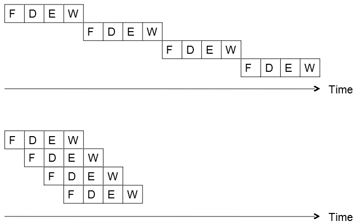  

**ideal vs practical pipeline**  
  1. identical ops ≡ some stages idle for some ops (**external fragmentation**), *e.g.* adder during memory op  
  2. independent ops ≡ need to detect & resolve inter-ops dependencies  
  3. uniform subops ≡ some stages too fast but common clock cycle time (**internal fragmentation**)  

**dependency types**  
  1. **data**  
  current instr needs previous output  
  flow dependence true data dependence, *i.e.* depends on value, other two due to lack of register IDs in ISA  
     1. **flow**  
     read after write  
     2. **output**  
     write after write  
     3. **anti**  
     write after read  
  2. **control**  
  next instr known once branch evaluated, special case of data dependence on `PC` register  
  3. **structural**  
  resource conflict, *e.g.* data & instr same bus  

**detecting dependencies**  
  1. **scoreboarding**  
  each register has valid flag  
  if `flag = 0` register will be written by some other instr  
  check operand valid flags at decode stage  
  2. **combinational dependence check logic**  
  check if any stage after decode will write to source register of current instr being decoded  

**resolving data dependencies**  
  1. **freezing**  
  pipeline stalled till dependency resolved  
  2. **compile-time detection & elimination**  
  insert `NOP`s (delay) compile time to resolve data dependencies  
  3. **data forwarding/bypassing**  
  data needed by consumer instr can be supplied directly from later stage in pipeline, instead of stalling then reading register  

**resolving control dependencies**  
  1. **freezing**  
  pipeline stalled till branch resolved  
  2. **prediction**  
  fetch instr before branch resolved, flushed instrs misprediction penalty  
     1. **predict-taken**  
     branch taken (*e.g.* loop), branched instr fetched  
     2. **predict-not-taken**  
     branch not taken, next sequential instr fetched  
     3. **dynamic prediction**  
     assumes next branch will be similar to previous branches  
     *e.g.* 2 bit predictor needs 2 incorrect guesses to change prediction scheme  
     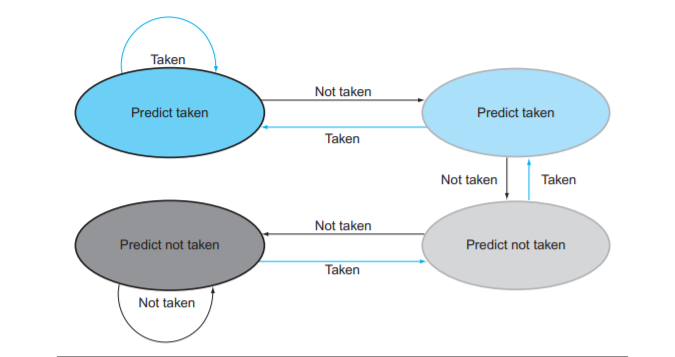
  3. **delayed branching**  
  execute instr that is independent of branch taken or not  
  4. **loop unrolling**  
  reduces branches  

**static scheduling**  
SW based, compiler orders instr then HW executes them in that order  

**dynamic scheduling**  
HW based, runtime instr ordering, extra runtime info (*e.g.* memory latency, branch direction)  

**multi-cycle execution**  
instr can take different cycles in execute stage, sequential semantics not preserved  
*e.g.* if first instr throws exception but second instr is already executed  
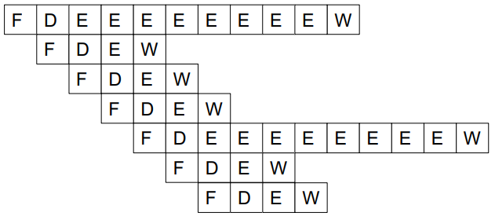

**exception**  
cause is internal to running process, handle when detected, *e.g.* divide by 0  

**interrupt**  
external to running process, handle when convenient (except high priority ones), *e.g.* mouse input when executable is running  a

**retired**  
instr finish execution & update arch state (registers, `PC`, memory)  

**precise exception/interrupt**  
all previous instr completely retired & no later instr retired, *i.e.* clean slate beween two instr, aids SW debugging  

**handling exception in pipelining**  
exception causing instr ready-to-be-retired ⟶ ensure arch state is precise ⟶ flush younger instr in pipeline ⟶ save `PC` & registers to stack ⟶ redirect to exception routine  

**dispatch**  
sending instr to functional unit  

**reorder buffer**  
complete instr out-of-order but reorder them before making results visible to arch state  
oldest instr retired first when done & no exception raised  
*i.e.* in-order dispatch, out-of-order execution, in-order retirement  
helpful for precise exceptions & rollback on mispredictions  
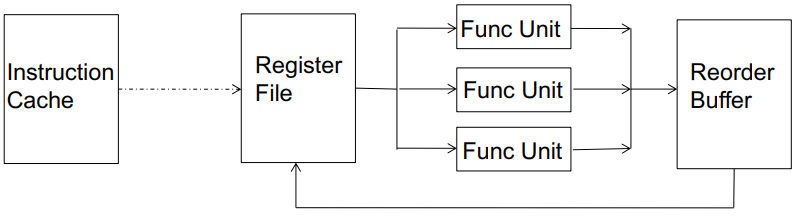  
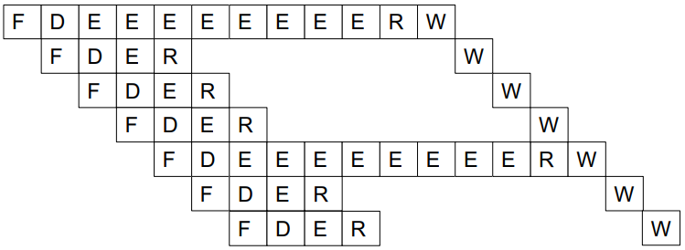  

**register renaming**  
in case of data dependency, register points to ROB entry that has/will output to that register, *i.e.* mapping of register to ROB entry, mapping keeps getting updated  
gives illusion that there are large number of registers, so eliminates output & anti dependencies  
used to link instr dependency, *i.e.* when instr completes it will broadcast ROB value to all dependent instr  

## Out-of-Order Execution

*a.k.a.* dynamic scheduling  

move dependent instr out of the way of independent ones  
similar to dataflow, *i.e.* fetch & dispatch instr only when its inputs are ready  
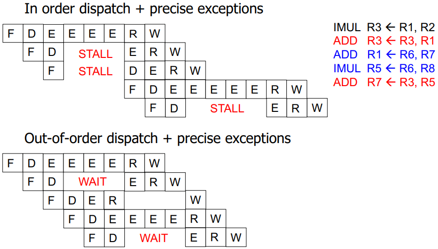

**reservation stations**  
rest areas for dependent instr or waiting for HW (*e.g.* adder/multiplier)  

**register alias table**  
table of ISA registers with corresponding "tag" or "value"  

**latency tolerance**  
allows independent instr to execute and complete in presence of long-latency operation *e.g.* memory access  

**frontend register file**  
for register renaming  
**architectural register file**  
for maintaining precise state  

**OoO execution** *a.k.a.* **Tomasulo's algorithm**  
  1. **find operand dependencies**  
  set `tag` as operand for dependencies (*i.e.* register renaming), else use `value` directly  
  2. **scheduling**  
  buffer instr to reservation stations, each functional unit (adder/multiplier) has its own reservation station  
  3. **execute when ready**  
  wait for data/resource dependencies to resolve  
  4. **dispatch instr if source values ready**  
  output "tag" broadcasted when value produced  
  each instr compare their source "tags" to broadcasted ones  
  instr "wakes up" when source values ready  
  5. **reorder output**  
  instr updates output value in register alias table *a.k.a.* frontend register file  
  instr added to reorder buffer  
  architectural register file updated when instr retires, *i.e.* oldest instr  
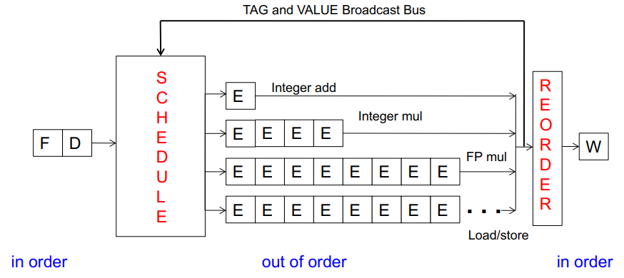  

**centralized physical register file**  
data values stored in physical registers that reservation stations & register alias table will access, instead of maintaining multiple data copies  
alias for physical register added in register alias table  
eliminates data broadcast but tag broadcast still needed  

**instruction window**  
all decoded but not yet retired instr  
OoO dynamically builds dataflow graph of this  

**register vs memory**  
register known statically ≡ memory determined dynamically  
small size ≡ large  
register state not visible to other threads ≡ shared  

**memory dependence handling**  
memory addr is not known till load/store executes *i.e.* addr computation needs to finish  
  1. memory addr renaming is difficult  
  2. determining dependence/independence needs to be handled after load/store partial execution  
  3. **memory disambiguation problem**  
  *a.k.a.* unknown address  
  when load/store has addr ready, there maybe older load/store with undetermined addr *i.e.* don't know if older instr will write same memory addr  

**how to detect load-store dependence**  
load dependence status is not known till all previous store addr are computed  
  1. wait until all previous stores committed  
  2. check whether load address matches with previous store addr stored in store queue  

**when to schedule load**  
  1. **conservative**  
  stall load until all previous stores have addr computed  
  no need for recovery, but delays independent loads unnecessarily  
  2. **aggressive**  
  assume load is independent of unknown-addr stores & schedule it  
  simple & more probable case, but recovery on misprediction  
  3. **intelligent**  
  predict if load is dependent on unknown-addr store  
  more accurate, but still recovery  

**store-to-load forwarding**  
cannot update memory out of program order  
load queue & store queue used  
after store execution, addr & data written to SQ (acts as store reorder buffer)
later when load calculates its addr  
  1. searches SQ with addr  
  for multi-word load, dependence on multiple SQ entries  
  2. access memory address  
  3. receive value from youngest older store  

## Superscalar Execution

per cycle multiple instr processed (fetch, decode execute & retire)  
`N`-wide superscalar means `N` instr per cycle, *i.e.* needs `N` data paths  

HW perfoms dependence check between concurrently-fetched instr  
vertical axis dependence check (OoO horizontal)  
*e.g.* expected `IPC == 2`, actual `IPC == 1.2`  
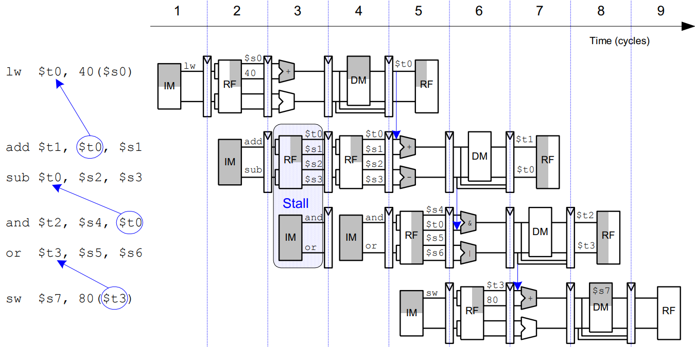  


[CONTINUE](https://youtu.be/uTdLCzdZvp4?list=PL5Q2soXY2Zi_QedyPWtRmFUJ2F8DdYP7l)