# Computer Vision

1. [To Do](#to-do)
2. [Links](#links)
3. [Intro](#intro)
4. [Filtering](#filtering)
   1. [Average](#average)
   2. [Non Linear Filters](#non-linear-filters)
   3. [Derivative](#derivative)
5. [Feature Detection \& Matching](#feature-detection--matching)
   1. [Harris Corner Detector](#harris-corner-detector)
   2. [Scale Invariant Feature Transform](#scale-invariant-feature-transform)

## To Do

- [feature detection & matching](https://medium.com/@deepanshut041/introduction-to-feature-detection-and-matching-65e27179885d)
- [CV guide](https://www.quora.com/I-want-to-learn-Computer-Vision-Where-should-I-start)
- download papers for the algos
- [stanford CV tutorials](https://ai.stanford.edu/~syyeung/cvweb/tutorials.html)
- do FPCV after UCF CV
- then do Cyrill Stachniss for latest algos

## Links

- [Computer Vision (UCF, 2012)](https://www.youtube.com/watch?v=NPcMS49V5hg&list=PLd3hlSJsX_Imk_BPmB_H3AQjFKZS9XgZm)
- [First Principles of Computer Vision](https://www.youtube.com/channel/UCf0WB91t8Ky6AuYcQV0CcLw)
- [Practical Gaussian](https://bartwronski.com/2021/10/31/practical-gaussian-filter-binomial-filter-and-small-sigma-gaussians/)

## Intro

**perspective projection** aka **pinhole model**  
3D mapped to 2D  
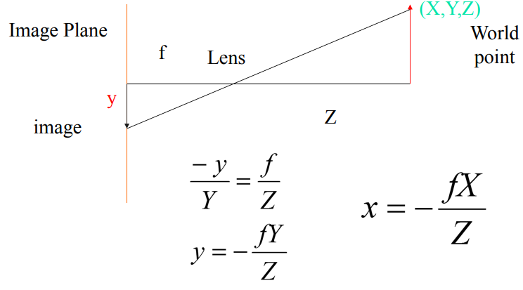  

**orthographic projection**  
picture taken from far away, *e.g.* UAV  
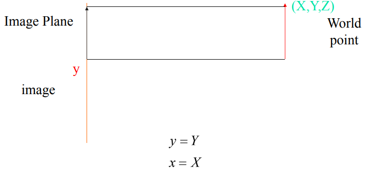  

**Lambertian model**  
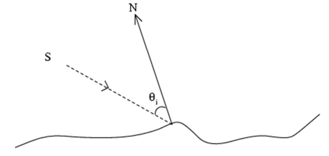  
`S` light source  
`Intensity = S · N`  

**histogram**  
frequency distribution of pixel intensities  

**filtering**  
changes the pixel values of an image  

**warping**  
changes the pixel positions of an image, *i.e.* points mapped to other points  

## Filtering

  

**correlation** (`⦻`)  
process of moving kernel over the image & computing the sum of products at each location  

**convolution** (`∗`)  
same as correlation but kernel flipped vertically then horizontally or vice-versa *i.e.* 180°  
convolution & correlation same for symmetric kernels *e.g.* Gaussian  

**seperable**  
from `n×n` multiplications to `2n`  
  

**edge pixels**  
  1. **extend**  
  nearest border pixel extended  
  2. **wrap**  
  values taken from opposite edge  
  3. **mirror**  
  edges mirrored *i.e.* to read a pixel 3 units outside an edge read one 3 units inside the edge instead  
  4. **crop**  
  any pixel which would require values from beyond the edge is skipped  
  5. **kernel crop**  
  any pixel in the kernel that extends past the input image isn't used and the normalizing is adjusted to compensate  
  6. **constant**  
  use constant value for pixels outside the image  

### Average

force pixels different to their neighbors (*e.g.* noise) to look like neighbors  

1. **mean**  
average of pixels in window  

2. **weighted mean**  
weighted average of pixels in window  

3. **Gaussian**  
special case of weighted mean  
weights inversely proportional to distance from centre pixel  
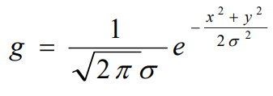  

4. **binomial**  
fast approximation to Gaussian  
*e.g.* `[ 1   2   1 ]` approx for Gaussian with `σ == 0.85`  
filter coefficients from Pascal's triangle  
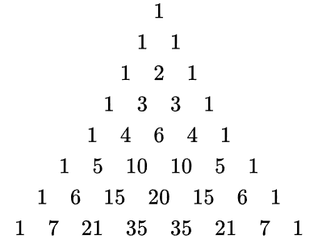  

### Non Linear Filters

cannot be implemented as comvolution  

1. **median**
assign median of `n×n` kernel as pixel value  
to remove extreme outlier noise  
edge preserving  

2. **bilateral**  
extension to Gaussian average  
remove noise but preserve edges  
only average pixels with intensity similar to centre pixel  
  
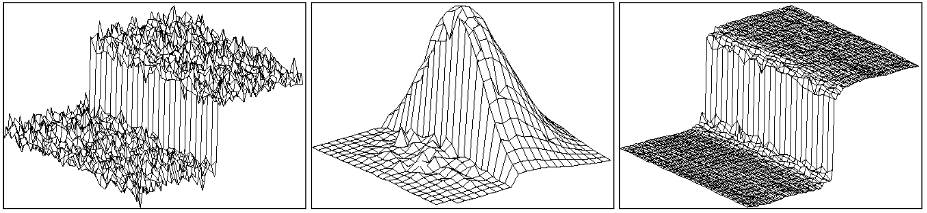  

### Derivative

rate of change  

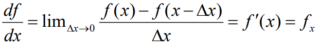  
`∆x == 1` in discrete domain, *i.e.* 180° `[-1   1   0 ]`  
  1. **backward difference**  
  `[-1   1   0 ]`  
  2. **forward difference**  
  `[ 0   1  -1 ]`  
  3. **central difference**  
  `[-1   0   1 ]`  

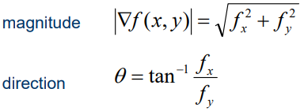  

**edge**  
intensity/color change  
derivative to find discontinuities  
for noise reduction average then derivative  

  1. **Prewitt**  
  ```
  mean × central difference

                          [ 1 ]   [-1   0   1 ]
  f'(x) = [-1   0   1 ] × [ 1 ] = [-1   0   1 ]
                          [ 1 ]   [-1   0   1 ]
  ```

  2. **Scharr**  
  ```
  weighed mean × central difference

                          [ 3  ]   [ -3   0   3  ]
  f'(x) = [-1   0   1 ] × [ 10 ] = [-10   0   10 ]
                          [ 3  ]   [ -3   0   3  ]
  ```

  3. **Sobel**  
  ```
  gaussian × central difference

                          [ 1 ]   [-1   0   1 ]
  f'(x) = [-1   0   1 ] × [ 2 ] = [-2   0   2 ]
                          [ 1 ]   [-1   0   1 ]
  ```

  4. **Marr-Hildreth**  
  *a.k.a.* Laplacian of Gaussian  
     
  **Laplacian**  
  sum of second derivative w.r.t. `x` & w.r.t. `y`  
  gradient `∇`, laplacian `∆`  
  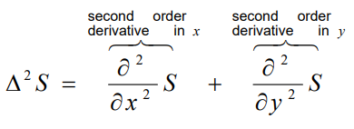  
     
  **procedure**  
  smooth image using Gaussian ⟶ apply Laplacian ⟶ find zero crossings  
     
  **improved procedure**  
  combine first two steps by using Laplacian of Gaussian instead of Laplacian of smoothened image  
  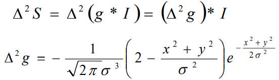  
  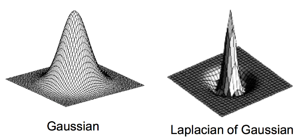  
     
  **zero crossings**  
  maxima & minimas become 0 in second derivative  
    1. { +, - }  
    2. { +, 0, - }  
    3. { -, + }  
    4. { -, 0, + }  
     
  edge strength is zero crossing slope *e.g.* `slope = | a + b |` for `{ a, -b }`  
     
  **seperability**  
  `4n` multiplications instead of `n×n`  
  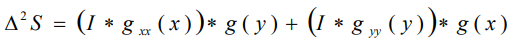  
  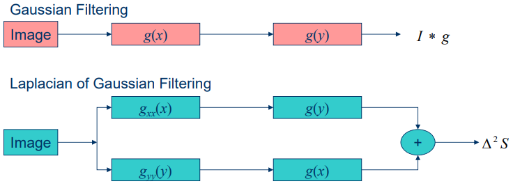  
     
  **difference of gaussian**  
  approximation to LoG  
  `DoG = g(2σ) - g(σ)`  
  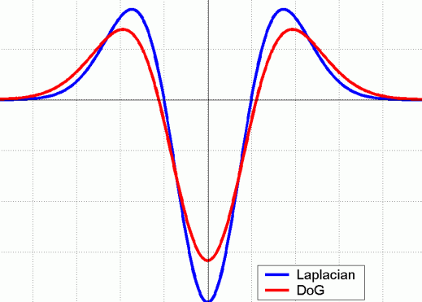  

  5. **Canny**  
  *a.k.a.* Gradient of Gaussian  
     
  **procedure**  
  smooth image with Gaussian ⟶ derivate ⟶ compute gradient magnitude & direction ⟶ non-maximum suppression ⟶ hysteresis threshold  
     
  **improved procedure**  
  combine first two steps by using derivative of Gaussian  
     
  **non-maximum suppression**  
  suppress pixels that are not maximum in the direction of the gradient  
  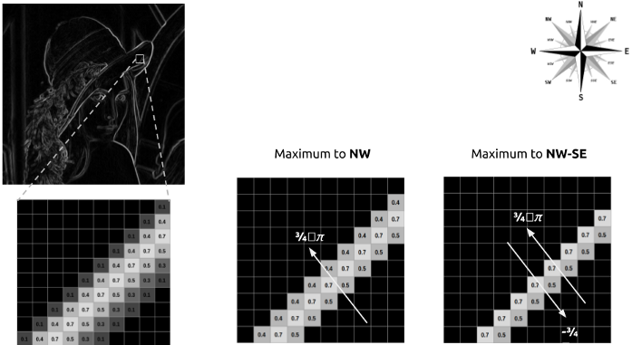  
     
  **hysteresis threshold**  
  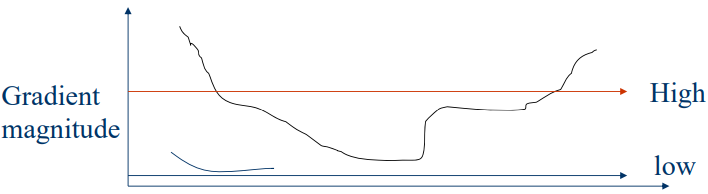  
     1. `mag > high` edge  
     2. `mag < low` not edge  
     3. `high > mag > low` edge only if connected to another edge pixel directly or via pixel between two thresholds  

## Feature Detection & Matching

feature point detection ⟶ extract feature descriptor ⟶ match two descriptors  

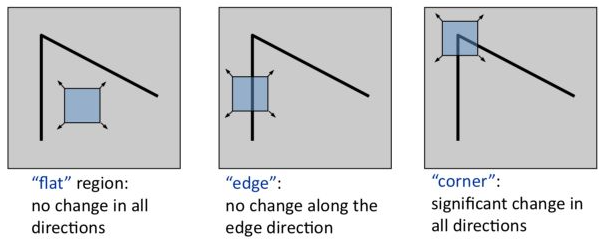  

**cross-correlation**  
correlate one window with another window  
high value if they are similar  
**auto-correlation**  
special case of cross-correlation  
correlate window with shifted copy of itself  
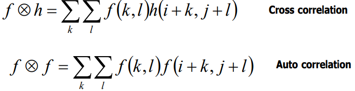  

**sum of squared differences**  
similar to correlation, but instead of multiplication take square of difference  
low value if they are similar  
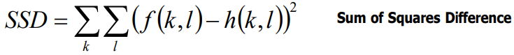  

**SSD & correlation**  
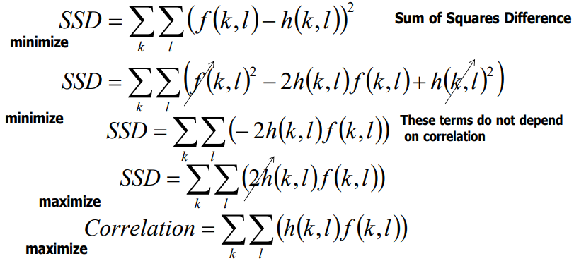  

### Harris Corner Detector

calculate gradient `Ix` & `Iy` ⟶ compute terms in `M` ⟶ calculate `R` ⟶ threshold `R` ⟶ non-maximum suppression  
find difference in intensity for a displacement `(u, v)` in all directions  
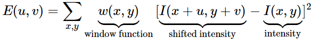  

using Taylor Series approximation  
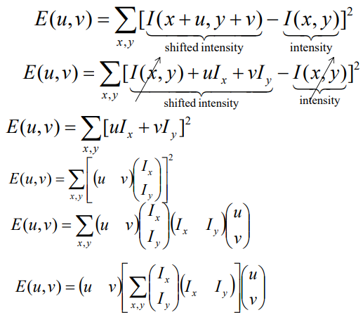  

we get  
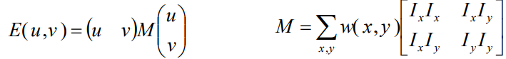  

score to determine corner  
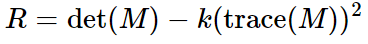  
if `λ1` & `λ2` are eigenvalues of M  
`det(M) = λ1 × λ2`  
`trace(M) = λ1 + λ2`  
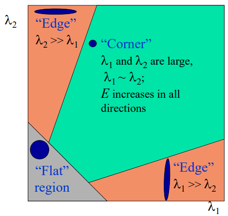  
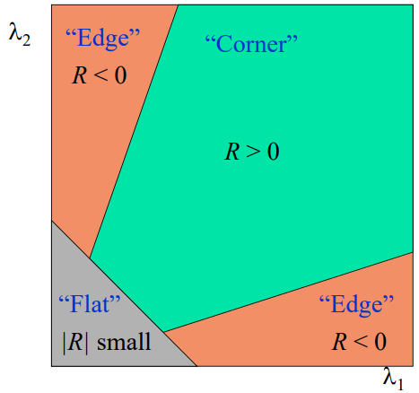  

then find pixels with `R` that exceed certain threshold & are local maxima within certain window (to prevent redundant duplicates)  

other variations  
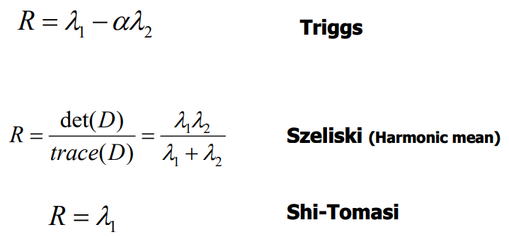  


### Scale Invariant Feature Transform

scale space peak selection ⟶ keypoint localization ⟶ orientation assignment ⟶ keypoint descriptor  

**scale space peak selection**  
local extrema (min/max of 27 pixels) in LoG scale space  
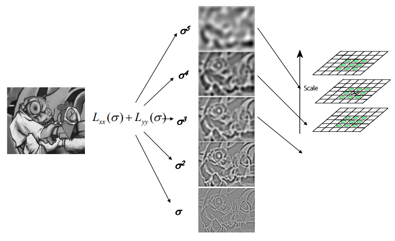  