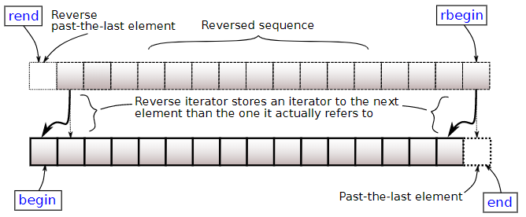
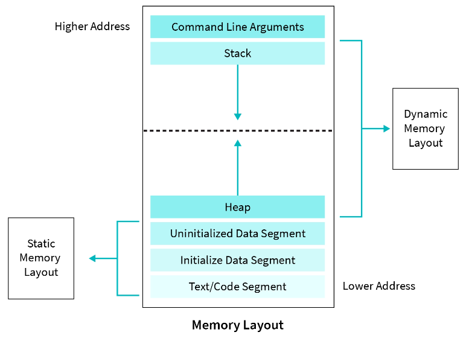

# C++

1. [To Do](#to-do)
2. [Links](#links)
3. [Intro](#intro)
4. [Sequence Containers](#sequence-containers)
5. [Associative Containers](#associative-containers)
6. [STL](#stl)
7. [OOP](#oop)
8. [Move Semantics](#move-semantics)
9. [Inheritance & Polymorphism](#inheritance--polymorphism)
10. [Memory](#memory)
11. [Streams](#streams)
12. [Pointers](#pointers)
13. [Templates](#templates)
14. [Error Handling](#error-handling)
15. [Misc](#misc)

## To Do

- pointer variations list
- [SDE Prep guide](https://www.geeksforgeeks.org/sde-sheet-a-complete-guide-for-sde-preparation/)
- try GProf
- [spiral rule](https://riptutorial.com/c/example/18833/using-the-right-left-or-spiral-rule-to-decipher-c-declaration)
- [recommended GCC compiler & linker flags](https://developers.redhat.com/blog/2018/03/21/compiler-and-linker-flags-gcc)
- [Bungee C++ guidelines](https://www.bungie.net/en/News/Article/50666)
- [sructure packing](http://www.catb.org/esr/structure-packing/)
- [mix c & c++](https://isocpp.org/wiki/faq/mixing-c-and-cpp#:~:text=Just%20declare%20the%20C%20function,int)%3B%20%2F%2F%20one%20way)
- [TU Delft tutorials](https://www.delftstack.com/)

## Links

- [Modern C++ (Uni Bonn, 2018)](https://www.youtube.com/playlist?list=PLgnQpQtFTOGR50iIOtO36nK6aNPtVq98C)

## Intro

**standard I/O channels**  
1 input (`stdin`) & 2 output (`stdout` & `stderr`)  
```cpp
std::cout << "out log" << std::endl;  // std::cerr
fprintf(stderr, "error log");         // stdout
```

**preprocessor**  
continuation (`\`), stringize (`#`), token pasting (`##`)  
```cpp
#error message    // preproc error
__DATE__              // May 16 2022
    __TIME__          // 09:42:38
        __FILE__      // /home/arun/Work/practice/test.cpp
            __LINE__  // 23

#define macro_func(a, b) printf("val" #a " : %d, " #b " : %d\n", val##a, val##b)

int main(void)
{
    int val1 = 40;
    int val2 = 30;
    macro_func(1, 2);  // val 1 : 40, 2 : 30
    return 0;
}
```

**compiler**  
preprocessor ⟶ compiler ⟶ assembler ⟶ linker  
```
-std=c++11            set C++ standard
-Wall                 all warnings
-Wextra               extra warnings
-Werror               warnings as errors
-O0, -O1, -O3         speed optimization
-Os                   size optimization
-Og                   debug optimization
-ftree-vectorize      auto vectorization
-g                    keep debugging symbols
-pg                   to use gprof
-l                    library
-L                    library search path
-I                    include search path
-D<flag>=<value>      add preprocessor flag
-fPIC                 Position Independent Code (suitable for inclusion in lib)
-c                    compile but don't link
-save-temps           save intermediate source files
```

**bitwise operators**  
```
A     = 0011 1100
B     = 0000 1101
-----------------
A&B   = 0000 1100     AND
A|B   = 0011 1101     OR // (same bit == 0, else == 1)
A^B   = 0011 0001     XOR
~A    = 1100 0011     NOT
A<<2  = 1111 0000     RSH
A>>2  = 0000 1111     LSH
```
```cpp
// XOR number swap
x = x ^ y;  // x == x ^ y
y = x ^ y;  // y == (x ^ y) ^ y ⟶ (y ^ y) ^ x ⟶ 0 ^ x ⟶ x
x = x ^ y;  // x == (x ^ y) ^ x ⟶ (x ^ x) ^ y ⟶ 0 ^ y ⟶ y
```
```cpp
// bit manipulation
#define SET_BIT(num, idx) (num |= (0x1 << idx))     // num |= 1 << idx;
#define CLEAR_BIT(num, idx) (num &= ~(0x1 << idx))  // num &= ~(1 << idx);
#define FLIP_BIT(num, idx) (num ^= (0x1 << idx))    // num ^= 1 << idx;
```

**func overloading**  
infer function from args (not return type)  

**func default args**  
only in declaration, after mandatory args  

**command line args**  
`int main(int argc, char const *argv[])`  
```
./exe_main command line args
argc == 4
argv[] == {"exe_main", "command", "line", "args"}
```

**ranged for loop**  
```cpp
int a[] = {0, 1, 2, 3, 4, 5};
// for(const auto& value : container)
for (int n : a)
{
    std::cout << n << " ";
}
```

**`break`** vs **`continue`**  
exit loop ≡ skip to next iteration  

```cpp
for (;;)   // K&R style, no warning
while (1)  // readable but compiler warning for condition always true
```

```cpp
while (i = 0)   // set i, use i as condition (0 here)
while (i == 0)  // use (i == 0) condition
```

```cpp
do
{
    ...
    break;  // break without returning
    ...
} while (0)
...
return 0;
```

```cpp
int main()
{
    goto second;
    printf("1\n");
second:
    printf("2\n");  // only prints this

    return 0;
}
```

**library**  
logically connected multiple object files  
  1. **static**  
  linked into final executable  
  ```
  ar rcs lib.a module1.o module2.o
  ```
  2. **dynamic**  
  loaded every time executable is executed  
  ```
  gcc -c -fPIC main.c -o main.o
  gcc -shared main.o -o libmain.so
  ```

## Sequence Containers

**iterator**  
similar to pointer  
```cpp
T::iterator  // itr
*itr         // current element
++ itr       // next element
```
  

**string**  
```cpp
#include <string>
std::string str;
+                       // concatenate
pos = str.find(substr)  // find substring pos
str.empty()             // check empty
str.size()              // size
str.data()              // underlying c array
str.c_str()             // NULL terminated string
str[i]                  // access
str.at(i)               // access with bounds checking
str.front()             // first char, back()
str.clear()             // clear string
str.pushback(char)      // add char at end, popback()
str.reserve(size)       // reserve size (prevent frequent mem alloc)
str.shrink_to_fit()     // dealloc unused mem
```

**vector**  
dynamic contiguous array  
```cpp
#include <vector>
std::vector<T> vec;
// empty, size, data, c_str(), [i], at(i), front, clear, pushback, reserve, shrink_to_fit & iterators
```

**array**  
static contiguous array  
```cpp
#include <array>
std::array<T, size> arr;
arr.fill(value)  // assign value all elements
// empty, size, data, c_str() [i], at(i), front, clear & iterators
```

**deque**  
double-ended queue (2 sided vector, non contiguous mem)  
```cpp
#include <deque>
std::deque<T> dq;
dq.pushfront(char)  // add char at beginning, popfront()
// empty, size, [i], at(i), front, clear, pushback, shrink_to_fit & iterators
```

## Associative Containers

sorted data structures  

**pair**  
```cpp
#include <utility>
std::pair<T1, T2> pr;
pr = std::make_pair(val1, val2)  // create pair
pr.first                         // first element, second
```

**map**  
collection of key-value pairs, sorted by unique keys  
```cpp
#include <map>
std::map<keyT, valT> mp;
mp[key] = val;                        // insert/assign
<posItr, bool> = insert({key, val});  // insert value if not exists
posItr = mp.find(key);                // find element
// empty, size, at(key), clear & iterators
```

## STL

```cpp
#include <algorithm>
flag = std::all_of(startItr, endItr, boolFunc);      // all_of, any_of, none_of
std::for_each(startItr, endItr, func);               // for_each
itr = std::find(startItr, endItr, val_or_boolFunc);  // find
std::fill(startItr, endItr, value);                  // fill
std::generate(startItr, endItr, func);               // generate
std::replace(startItr, endItr, old_val, new_val);    // replace
std::rotate(startItr, new_startItr, endItr);         // rotate
std::sort(startItr, endItr, operator);               // default std::less<T>, greater<>
std::reverse(startItr, endItr);                      // reverse
float sum = std::accumulate(startItr, endItr, initValue,
                            operation);  // default std::plus<T>, minus<>, multiplies<>, divides<>, modulus<>
```

```cpp
#include <stdio.h>
FILE *fp;
fp = fopen("filename", "mode");  // r, rb, w, wb, a, ab
fprintf(fp, char *....);
fwrite(ptr, size, num_mem, fp);  // fread
fclose(fp);
getchar();
```

```cpp
#include <stdlib.h>
ptr = malloc(size);  // malloc(0) valid pointer, implementation defined
ptr = calloc(num_mem, size);
ptr = realloc(ptr, newSize);
free(ptr);
abs(val);
atoi(str);     // string to int
assert(expr);  // assert if expr false
```

```cpp
#include <string.h>
size = strlen(string);  // size excluding NULL (\0)
memcpy(dst, src, size);
memset(ptr, val, size);
```

```cpp
#include <math.h>
ceil(num);
floor(num);
fabs(num);
pow(num, power);
sqrt(num);
```

```cpp
#include <unistd.h>
sleep(numSeconds);  // usleep(numUSeconds)
```

```cpp
#include <time.h>
clock_t t;
t = clock();
...
t = clock() - t;
double time_taken = ((double)t) / CLOCKS_PER_SEC;
```

## OOP

**`namespace`**  
avoid name conflicts & group into logical modules  

**`class`**  
data & method encapsulation, `this` pointer to current instance  
```cpp
// nameless namespace, local to translation unit
// like static but can also take user defined types
namespace
{
const int k_size = 100;
}

class someClass
{
public:                                              // default access specifier
    someClass() {}                                   // constructor, atleast one
    ~someClass() {}                                  // destructor, atleast one
    someClass(int a, int b) : numA_(a), numB_(b) {}  // initializer list
    someClass &operator=(someClass &arg) {}          // operator overload
    someFunc() const {}                              // const correctness, should not change object
    static void someSFunc() {}                       // call without instance, define in *.cpp
    static int someNum;                              // common across all instances, define in *.cpp

protected:
private:
    int numA_;
    int numB_;

    // friend, give another class/func access to private & protected
    friend class anotherClass;                // friend class
    friend int add(someClass, anotherClass);  // friend function
};
```

**`struct`**  
`class` with everything `public`  

**forward declaration**  
```cpp
class A;  // FD
class B;  // FD

class A
{
    friend int sum(A, B);  // without FD error, B undefined
};

class B
{
    friend int sum(A, B);
};
```

## Move Semantics

**lvalue** vs **rvalue**  
occupies memory ≡ everything else  
`std::move` convert lvalue to rvalue `int&& b = std::move(a)`  
dont access after move  
```cpp
// copy constructor
MyClass(MyClass &other) {}
// copy assignment operator
MyClass &operator=(MyClass &other) {}
// move constructor
MyClass(MyClass &&other) {}
// move assignment operator
MyClass &operator=(MyClass &&other) {}
```
```cpp
MyClass a;      // default constr
MyClass b(a);   // copy constr
MyClass c = b;  // copy constr
a = b;          // copy assign op

MyClass b(std::move(a));   // move constr
MyClass c = std::move(b);  // move constr
a = std::move(b);          // move assign op
```

**rule of all or nothing**  
define all 6 special functions (destr + constr + above 4) or define none (`default` used)  
```cpp
MyClass() = default;       // autogenerated funcs, shallow copy
void someFunc() = delete;  // error if func used
```

## Inheritance & Polymorphism

**inheritance**  
inherit data & methods from other classes, seperate 6 special funcs, cannot access private members  
```cpp
class Base
{
public:
    Base(int x, int y) protected : int x;
    int y;
} class Derived : public Base   // public (same as base)
{                               // protected (both protected)
public:                         // private (both private)
    Derived(x) : Base(x, x) {}  // base constr initialization list
}
```

**polymorphism**  
morph derived classes into base class type `const Base& base = derived;`  

**func overriding**  
same func prototype in both base & derived  
overloading (compile time) ≡ overriding (runtime)  
```cpp
class Base
{
public:
    virtual void print() { cout << "Base Function" << endl; }
};

class Derived : public Base
{
public:
    void print() override  // override : compiler errors
    {                      // virtual void print() {} : old way
        cout << "Derived Function" << endl;
    }
};

int main()
{
    Derived derived1;
    Base base1;
    Base *base2 = &derived1;

    derived1.print();  // derived print
    base1.print();     // base print
    base2->print();    // derived print, without virtual : base print

    return 0;
}
```

**pure virtual function**  
no base implementation `virtual func() = 0;`  

**abstract class**  
atleast one pure virt func (instance not possible)  

**interface**  
only pure virt func & no data members  

## Memory

**type qualifiers**
  1. **`const`**  
  read only  
  2. **`volatile`**  
  value can change unexpectedly, no caching, `const volatile` read-only status register  
  3. **`restrict`**  
  other pointer will not reference overlapping memory  
  4. **`_Atomic`**  
  read-modify-write operators guaranteed in single instruction  
  ```cpp
  #include <stdatomic.h>
  #ifdef __STDC_NO_ATOMICS__
  #error no atomics
  #endif

  _Atomic const int *p1;   // pointer to atomic const int
  const atomic_int *p2;    // same
  const _Atomic(int) *p3;  // same
  ```

**storage classes**
  1. **`auto`**  
  default, local scope  
  2. **`extern`**  
  keep declarations in header, cross checking b/w translation units  
  ```cpp
  // header.h
  extern int g_val;
  extern int increment(void);

  // source1.c
  #include "header.h"
  int g_val = 77;
  int incrememt(void) { return (++g_val); }

  // source2.c
  #include "header.h"
  printf("%d\n", g_val);        // 77
  printf("%d\n", increment());  // 78
  ```
  3. **`static`**  
  local to translation unit (localized global), reuse name  
  ```cpp
  static int a = 0;  // explicitly static
  const int b = 1;   // implicitly static
  extern int c = 2;  // explicitly extern
  int d = 3;         // implicitly extern
  ```
  4. **`register`**  
  suggestion to compiler  

**struct padding**  
align members to natural address boundaries, **packing** prevent padding  

**struct bitfields**  
can be smaller than granularity allowed by pointers, so pointer not possible  
```cpp
typedef struct
{
    uint8_t a : 4;
    uint8_t b : 4;
} two_nibbles;

two_nibbles temp;
temp.a = 5;
temp.b = 17;
printf("%u %u %u\n", sizeof(temp), temp.a, temp.b);  // 1 5 1 (4 bit overflow)
```

**int representation**  
range `-2^(n-1)` to `2^(n-1) -1`  
`10000000` 2s complement same binary, so assumed `-128`  
```
00011001 //  25 memory
11100110 //  1s complement
11100111 // -25 memory, 2s complement (+1)
```

**integer promotion**  
`signed` promoted to `unsigned` when mixed  
```cpp
unsigned int a = 6;
int b = -20;
(a + b > 6) ? printf("> 6\n") : printf("<= 6\n");  // > 6
```

**sign extension**  
```
1001 0110           //  8 bit (-106)
1111 1111 1001 0110 // 16 bit (-106)
```

**float representation (IEEE 754)**  
single precision `1 + 8 + 23`  
double precision `1 + 1 + 53`  
  
```
263.3                         // number
100000111.0100110011...       // binary
1.000001110100110011... x 2^8 // scientific notation, true exp = 8
                              // 1 : invisible leading bit
sign = 0 
exp = 127 + 8 = 1 = 10000111  // 2^(n-1)-1 bias
mant = 00000111010011001100110

0 10000111 00000111010011001100110
```

**big endian** vs **little endian**    
`0x12345678` -> `12`, `34`, `56`, `78`  
≡  
`0x12345678` -> `78`, `56`, `34`, `12`  
```cpp
uint32_t num = 9;
uint32_t b0, b1, b2, b3;
uint32_t res;

b0 = (num & 0x000000ff) << 24u;
b1 = (num & 0x0000ff00) << 8u;
b2 = (num & 0x00ff0000) >> 8u;
b3 = (num & 0xff000000) >> 24u;

res = b0 | b1 | b2 | b3;
```

**memory layout**  
  
  1. **text**  
  read only instructions, `.rodata` read only const global data  
  2. **data**  
  initialized `global` & `static` var (`static` func text)  
  3. **bss**  
  uninitialized, only size mentioned in exe, alloc after program load  
  4. **heap**  
  dynamic alloc  
  `float* f_ptr = new float[num];` allocate array (`delete[] f_ptr`)  
  `std::bad_alloc` run out of heap  
  **memory leak**  
  heap not dealloced (or address lost)  
  **dangling pointer**  
  pointing to dealloced memory  
  **wild pointer**  
  pointing to random address  
  5. **stack**  
  simple LIFO, no complex data structure  
  local variables, func params, inheritance virtual func table  
  **stack overflow**  
  running out of stack  
  **stack frame**  
  func data (return addr, args, local vars) pushed onto stack, ARM first 4 args stored `r0` to `r3`  

**fragmentation**  
when memory is allocated in large number of non-contiguous blocks, leaving large part of total memory unallocated but unusable  

**shallow copying**  
just copy pointers, not data (default copy constr/assign)  
**deep copying**  
copy data, create new pointers  

## Streams

**fstream**  
  1. **types**  
  `ifstream` read  
  `ofstream` write  
  `fstream` both  
  2. **modes**  
  `app` append  
  `binary` binary mode  
  `in` read  
  `out` write  
  `trunc` overwrite  
  `ate` seek EOF  
```cpp
#include <fstream>
int a;
string b;
float c, d;
// std::fstream f_in_out(string& filename, Mode ios_base::mode);
// ret = getline(fstream, string);
std::ifstream in("test_cols.txt", ios_base::in);
while (in >> a >> b >> c >> d)
{
    std::cout << a << b << c << d << std::endl;  // 10 dummy 0.34 1.65
}

int test_data[1000];
std::ofstream out("test.bin", ios_base::out | ios_base::binary);
// fstream.write(reinterpret_cast<int8_t*>(data), sizeof(data));
out.write(reinterpret_cast<int8_t *>(test_data), sizeof(test_data));
```

**sstream**  
single string different types  
```cpp
#include <sstream>
std::stringstream sstream;
sstream << "Hello" << "1234";
std::string str = sstream.str();
std::cout << str << std::endl;
```

## Pointers

**pointer** vs **reference**  
own memory ≡ alias  
no init required ≡ init in declaration  
can reassign ≡ cannot  
can NULL ≡ cannot  
indirection (levels of pointers) ≡ single level  
can arithematic ops ≡ cannot  
can store in vec/array ≡ cannot  

**const pointers**  
```cpp
// read right to left
const int *       // pointer to const int
int *const        // const pointer to int
const int *const  // const pointer to const int
```

**smart pointer**  
  1. **unique**  
  `std::unique_ptr<Foo> uPtr(new Foo);`  
  can only be moved not copied  
  2. **shared**  
  `std::shared_ptr`  
  can be copied  
  when copied `++usage_count`  
  when destructed `--usage_count`  
  mem freed when `usage_count == 0`  
```cpp
#include <memory>
sPtr.get()        // get raw pointer
sPtr.use_count()  // return usage count
sPtr.reset(ptr)   // decrease use count
```

**type casting**  
```cpp
static_cast       // implicit convertion between types
const_cast        // remove const from const ref of non const variable
reinterpret_cast  // reinterpret bytes of one type as another type
dynamic_cast      // runtime, converts ptrs/refs up/down/sideways along inheritance hierarchy (`nullptr` if failed)
```
```cpp
uint u = (uint)(-9);  // same bit pattern (2s complement)
```

**func pointer**  
```cpp
int foo(int);     // function
int *foo(int);    // func returning int*
int (*foo)(int);  // func pointer, change precedence using ())
```
```cpp
int foo(int arg)
{
    printf("foo %d\n", arg);

    return arg;
}

int main()
{
    int (*func_ptr)(int);       //      OR
    func_ptr = &foo;            // func_ptr = foo;
    int ret = (*func_ptr)(10);  // int ret = func_ptr(10)
    printf("ret %d\n", ret);

    return 0;
}
```

```cpp
int a;              // int
int *a;             // pointer to int
int **a;            // pointer to pointer to int
int a[10];          // array of 10 ints
int *a[10];         // array of 10 pointers to ints
int (*a)[10];       // pointer to array of 10 ints
int (*a)(int);      // pointer to function a that takes int argument & returns int
int (*a[10])(int);  // array of 10 pointers to functions that take int argument & return int
```

## Templates

compile time type independent/generic algorithms  
whenever used macro `<T>` expanded, no definition till expansion (linker error)  

**template func**  
```cpp
template <typename T>  // typename/class
T Func1()
{
}

template <typename S>
S Func2(const S &arg1)
{
}

Func<int>();  // explicit type
Func2(10);    // type infered by compiler
```

**template class**  
```cpp
template <typename T>
class MyClass
{
public:
    MyClass(const T &var) : var_(var){};

private:
    T var_;
}

MyClass<int> my_object(10);
```

**specialization**  
different template implementation for a specific type  
```cpp
template <typename T>  // generic
T Func()
{
}

template <>  // specialized
int Func()
{
}

Func<int>();     // specialized
Func<double>();  // generic
```

## Error Handling

**exceptions**  
  - `logic_error`  
  - `invalid_argument`  
  - `domain_error`  
  not defined for certain domain  
  - `length_error`  
  exceeds max size  
  - `out_of_range`  
  access out of bounds  
  - `runtime_error`  
  - `range_error`  
  requested operation doesn't make mathematical sense in the domain considered, *e.g.* `srqt(negative_number)` in real domain  
  - `overflow_error`/`underflow_error`  
  result exceeds capacity of underlying type  

**`try`** ⟶ **`throw`** ⟶ **`catch`**  
```cpp
#include <stdexcept>

void someFunc(void)
{
    if (badEvent)
    {
        string msg = "error string";
        throw runtime_error(msg);
    }
}

try
{
    x = someFunc(a, b, c);  // throws exception
}
catch (runtime_error &exp)
{
    cerr << "runtime error: " << exp.what() << endl;  // exp.what(), get error message
}
catch (logic_error &exp)
{
    cerr << "logic error: " << exp.what() << endl;
}
catch (exception &exp)  // generic
{
    cerr << "some exception: " << exp.what() << endl;
}
catch (...)  // catch everything
{
    cerr << "unknown exception" << endl;
}
```

## Misc

**`using`**  
`using newType = oldType;`  
create type aliases  
similar to `typedef`  
```cpp
using Image3f = Image<float, 3>;
using vector3d_t = double[3];  // not possible using `typedef`
```

**why typedef over macro**  
```cpp
#define type1 struct s *
typedef struct s *type2;

type1 a, b;  // "a" pointer-to struct & "b" struct
type2 c, d;  // "c" & "d" pointer
```

**name mangling**  
encoding of function/variable names so linker can seperate common names (overloading, namespaces), so client C code cannot link to function  
```cpp
extern "C"
{
    ....
}
```

**maximum munch rule**  
compiler should bite off biggest legal chunk  
```cpp
c = a+++b;  // a++ + b
```

**format specifiers**  
```cpp
%c  // char
%s  // string
%i  // int
%u  // uint
%o  // unsigned octal
%x  // unsigned hex
%e  // exponent notation
%f  // float
%g  // float no trailing 0s, selects %f/%e
%p  // pointer
```

**data type constants**  
```cpp
0x  // hex
0   // oct
U   // uint
L   // long int, UL
LL  // long long int, ULL
F   // float
```

**enum**  
assign names to integral constants  
  1. **unscoped**  
  can implicitly convert  
  2. **scoped**  
  implicit convertion error, use `static_cast`  
```cpp
enum Foo  // unscoped
{
    a,
    b,
    c = 10,
    d,
    e = 1,
    f,
    g = f + c
};
int enumValue = Foo::a;  // implicit convertion

enum class cFoo  // scoped
{
    a,
    b,
    c = 10,
    d,
    e = 1,
    f,
    g = f + c
};
int enumValue = cFoo::a;  // error
```

**union**  
different variables of different types in same memory location  
```cpp
union unn
{
    int i;
    char c;
};
```

**typedef struct**  
```cpp
typedef struct S
{
    int x;
} S;

// same as
struct S
{
    int x;
};
typedef struct S S;
```

**nested struct/union**  
```cpp
typedef struct image
{
    struct coordinate
    {
        int x;
        int y;
    };
    struct coordinate pos;
} image;
```

**lambdas**  
function declared without name  
```cpp
auto plus_one = [](const int value) { return value + 1; };
```

**functor**  
class that acts like a function, done by overloading `operator ()`  
```cpp
struct PlusOne
{
    int operator()(const int value) const { return value + 1; }
};

int main()
{
    PlusOne plusOne;
    assert(plusOne(2) == 3);

    return 0;
}
```