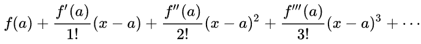

# Maths

1. [To Do](#to-do)
2. [Links](#links)
3. [Intro](#intro)

## To Do

- list CV prerequisites

## Links

- [Machine Learning (Stanford, 2019)](https://www.youtube.com/playlist?list=PLoROMvodv4rNH7qL6-efu_q2_bPuy0adh)

## Intro

**Taylor series**  
series expansion of a function about a point  
  

**eigenvector & eigenvalue**  
for square matrix `A`, eigenvector `u` & eigenvalue`λ`  
```
Au = λu

Au = λIu
Au - λIu = 0
(A - λI)u = 0
assuming u is non-zero, solve for λ using

det(Au - λI) = 0
```