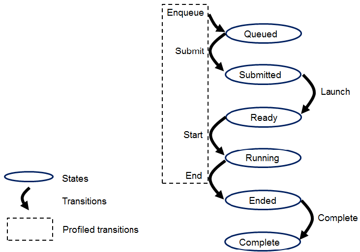
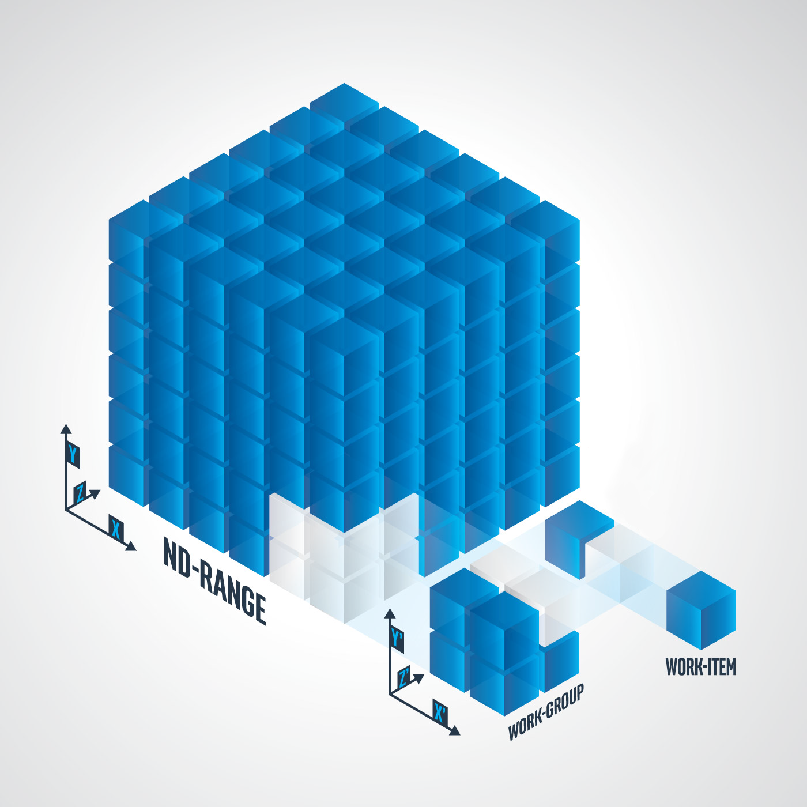

# Optimization

1. [To Do](#to-do)
2. [Links](#links)
3. [OpenCL](#opencl)

## To Do

- device side enqueue
- [optimization](https://www.milania.de/blog/category/OpenCL)
- [qcom optimization](https://www.qualcomm.com/news/onq/2018/10/opencl-optimization-developers-accelerating-sobel-filter-adreno-gpu)

## Links

- [Vulkan Compute (Lei Zhang)](https://www.lei.chat/posts/what-is-vulkan-compute/)

## OpenCL

**converged control flow**  
all threads execute same sequence of statements (**diverged**)  

**execution**  
queued ⟶ submitted ⟶ ready ⟶ running ⟶ ended ⟶ complete  
  

**NDRange**  
N Dimensional index space, `N == 1, 2, 3`  
  

**device side enqueue**  
one kernel (parent) can enqueue another kernel (child), parent `CL_COMPLETE` after all child completed successfully  

**synchronization**  
  1. **work-group**  
  all work-items must encounter same work-group function *i.e.* converged flow  
  2. **command**  
  between commands in command-queue  