- [digital design \& computer architecture](#digital-design--computer-architecture)
  - [links](#links)
  - [introduction](#introduction)
  - [combinational logic](#combinational-logic)
  - [sequential logic](#sequential-logic)
  - [timing \& verification](#timing--verification)
  - [instruction set architecture](#instruction-set-architecture)
  - [microarchitecture](#microarchitecture)
  - [pipelining](#pipelining)
  - [out-of-order execution](#out-of-order-execution)
  - [superscalar execution](#superscalar-execution)
  - [branch prediction](#branch-prediction)
  - [very-long instruction word](#very-long-instruction-word)
  - [fine-grained multithreading](#fine-grained-multithreading)
  - [single instruction multiple data](#single-instruction-multiple-data)

# digital design & computer architecture

## links

- [homepage](https://safari.ethz.ch/digitaltechnik/spring2018/doku.php?id=schedule)
- [lectures](https://www.youtube.com/playlist?list=PL5Q2soXY2Zi_QedyPWtRmFUJ2F8DdYP7l)
- [ARM assembly](http://www.cburch.com/books/arm/)
- [hamming code](https://harryli0088.github.io/hamming-code/)

## introduction

**computer architecture:** is the science & art of designing computing platforms (HW, interface, system SW & programming model)

**algorithm:** step-by-step procedure that is guaranteed to terminate (finiteness) where each step is precisely stated (definiteness) and can be carried out by a computer (effective computability)

**instruction set architecture (ISA):** interface/contract between software & hardware

**microarchitecture:** an implementation of ISA

**digital logic circuits:** building blocks of micro-arch (like gates)

**abstraction:** higher level only needs to know about the interface to lower level, not how lower level is implemented, levels of transformation creates abstractions

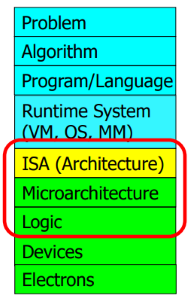

**example: meltdown & spectre:** hardware security vulnerabilities that exploit speculative execution (doing something before you know it is needed to improve performance), speculative execution leaves traces of secret data in processor's cache, a malicious program can inspect the contents of the cache to infer secret data

**example: rowhammer:** repeatedly opening & closing a DRAM row (aggressor row) enough times within a refresh interval induces disturbance errors in adjacent rows (victim row), this happens because DRAM cells are too close to each other, one cells affects the value in nearby cells due to electrical interference, "it's like breaking into an apartment by repeatedly slamming a neighbor's door until vibrations open the door you were after"

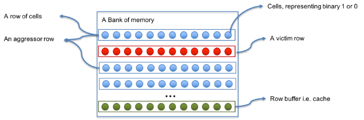

**example: memory performance attacks:** in a multi-core system to increase throughput DRAM controller services row-hit access first so programs with good memory spatial locality are preferred, DRAM controller usually services row-hit memory accesses first (row-hit first) then service older accesses first (oldest-first), DRAM controller vulnerable to denial of service attacks

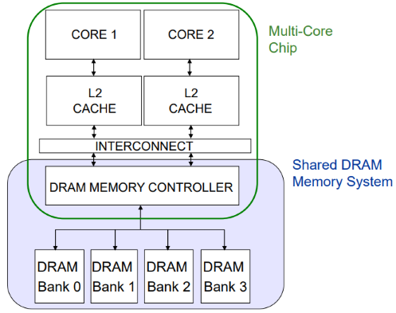

**example: DRAM refresh:** a DRAM cell consists of a capacitor & an access transistor, data stored in terms of charge status of capacitor but capacitors leak charge over time, memory controller needs to refresh each row periodically to restore charge, increases energy consumption and DRAM bank unavailable while refreshing, due to manufacturing process variation not all DRAM cells have same retention time (only small % have low retention time), check bins to determine refresh rate of a row once profiling (retention time of all DRAM rows) is done
 
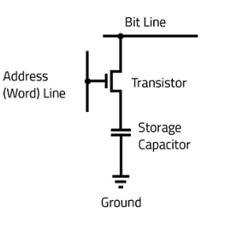

**hamming code:** powers-of-2 bits are regular parity bits used to track the parity of the other bits whose position have a 1 in the same place, 0th message bit used as overall parity, can correct 1-bit errors (regular parity incorrect & overall parity incorrect) and detect 2-bit errors (regular parity incorrect & overall parity correct)

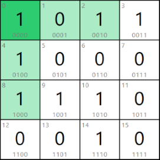

**bloom filter:** memory efficient probabilistic data structure that compactly represents set membership, test set membership using hash functions (unique identifier generator), never false negative and never overflows (but `num elements ∝ false positives rate`)

**field programable gate array (FPGA):** is an integrated circuit that can be programmed for a specific use after it has been manufactured, is a reconfigurable substrate (functions, interconnections, I/O), fills the gap between software & hardware, faster than software and more flexible than hardware, programmed using hardware description language (HDL) like Verilog & VHDL

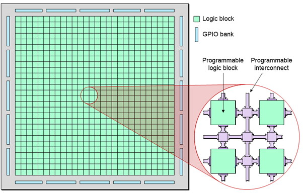

**iron law of processor performance:** trade-off between complexity and the number of instruction

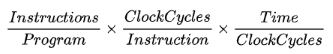

**amdahl's law:** overall performance improvement gained by optimization is limited by the fraction of time that improved part is actually used

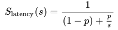  
`Slatency` theoretical speedup  
`s` speedup of optimized part  
`p` fraction of time

## combinational logic

**combinational logic:** output strictly dependent on current inputs (memoryless)

**duality:** replace `OR` ⟷ `AND` & `0` ⟷ `1`

**demorgan's law:**
```cpp
~(X + Y) == ~X · ~Y
~(X · Y) == ~X + ~Y
```

**complement:** *e.g.* `~A, ~B, ~C`  
**literal:** variable or its complement, *e.g.* `A, ~A, B, ~B, C, ~C `  
**implicant:** `AND` of literals, *e.g.* `(A · B · ~C), (~A · C)`  
**minterm:** `AND` of all inputs, *e.g.* `(A · B · ~C), (~A · ~B · C)`  
**maxterm:** `OR` of all inputs, *e.g.* `(A + B + ~C), (~A + ~B + C)`

**sum of products form:** sum of all minterms for which output is `1`

**uniting theorem:** eliminate input that can change without changing output

**gray code:** only one bit changes, `00` ⟷ `01` ⟷ `11` ⟷ `10` ⟷ `00`

**karnaugh maps:** group `2^n` number of adjacent `1`s (to eliminate varying literals), to simplify boolean expressions wrap around adjacency, `X` (dont care) can be used as either `1`/`0` for simpler equation

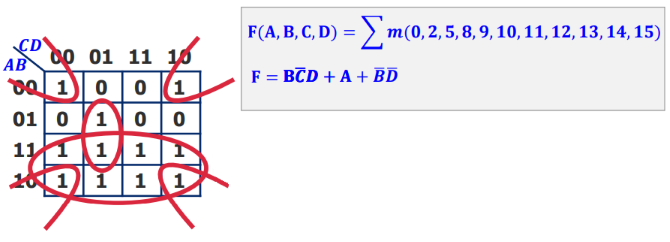

**multiplexer:** select one of `2^n` inputs & route to single output

**demultiplexer:** route single input to one of `2^n` outputs

## sequential logic

**sequential logic:** output dependent on previous & current inputs (memory)

**R-S latch:** if `S == 0` then `Q = 1`, if `R == 0` then `~Q = 1`, if `R == S == 0` then `Q = ~Q = 1`

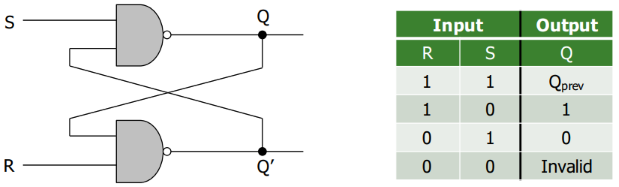

**gated D latch:** `Q = D` when `WE == 1`

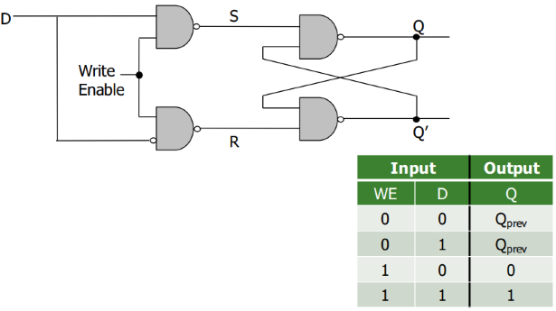

**D flip flop:** state change only on clock edge & data available full cycle, clock low ⟶ master sends `D` ⟶ clock high ⟶ slave stores `D` in `Q` (rising edge `Q = D`)

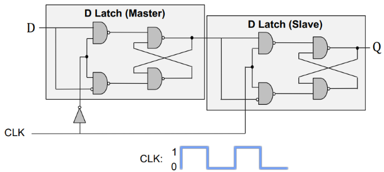

**finite state machines (FSM):** discrete time model of system, *e.g.* snail looking for `1101` pattern
1. **moore:** output depends on current state
2. **mealy:** output depends on current input & current state

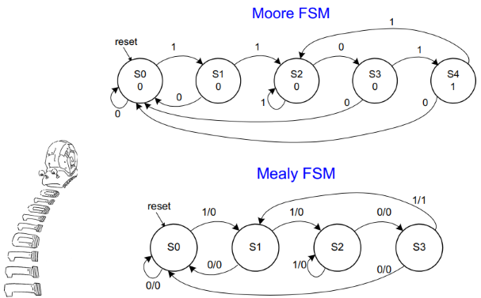

## timing & verification

**combinational circuit delay:** output doesn't change instantaneously with input

**glitch:** one input transition causes multiple output transitions, visible on K-maps (resolve by adding `~A · C`)

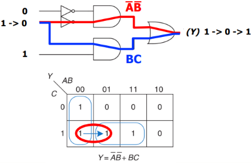

## instruction set architecture

**instruction set architecture (ISA):** interface between software & hardware, defines set of instructions supported by the processor

**data flow model:** instruction fetched & executed when its operands are ready, inherently more parallel  
**von-neumann model:** stored program (intr & data memory unified), sequential instruction processing (one instruction processing at a time)

**instruction cycle:** fetch ⟶ decode ⟶ evaluate address ⟶ fetch operands ⟶ execute ⟶ store result

**important registers:**
1. **stack pointer (`SP`):** address of top of stack
2. **link register (`LR`):** return address
3. **program counter (`PC`):** address of current instruction
4. **program status register (`PSR`):** zero (`Z`), negative (`N`), carry (`C`), overflow (`V`)
5. **memory address register (`MAR`):** address to read/write
6. **memory data/buffer register (`MDR`/`MBR`):** data from read/write

**opcode/instruction:** most can postfix `S` to modify PSR flags, can be classified into
1. operate
2. data movement
3. control flow
```
AND regd, rega, argb    ; regd ⟵ rega & argb
EOR regd, rega, argb    ; regd ⟵ rega ^ argb
SUB regd, rega, argb    ; regd ⟵ rega - argb
RSB regd, rega, argb    ; regd ⟵ argb - rega, REVERSE SUB
ADD regd, rega, argb    ; regd ⟵ rega + argb
ADC regd, rega, argb    ; regd ⟵ rega + argb + carry
SBC regd, rega, argb    ; regd ⟵ rega - argb - !carry
RSC regd, rega, argb    ; regd ⟵ argb - rega - !carry
TST rega, argb          ; set flags for rega & argb, result discarded, TEST
TEQ rega, argb          ; set flags for rega ^ argb, result discarded, TEST EQUIVALENCE
CMP rega, argb          ; set flags for rega - argb, COMPARE
CMN rega, argb          ; set flags for rega + argb, COMPARE NEGATIVE
ORR regd, rega, argb    ; regd ⟵ rega | argb
MOV regd, arg           ; regd ⟵ arg
BIC regd, rega, argb    ; regd ⟵ rega & ~argb, BIT CLEAR
MVN regd, arg           ; regd ⟵ ~argb, MOV NOT
B                       ; BRANCH
LDR regd, [rega]        ; regd ⟵ *rega, LDRB for 8bit
STR regd, [rega]        ; regd ⟶ *rega, STRB for 8bit
```

**condition flags:**
```
EQ              equal                           Z
NE              not equal                       !Z
MI              minus/negative                  N
PL              plus/positive or zero           !N
VS              overflow set                    V
VC              overflow clear                  !V
GE              signed greater than or equal    N == V
LT              signed less than                N != V
GT              signed greater than             !Z && (N == V)
LE              signed greater than or equal    Z || (N != V)
AL/omitted      always                          true
```

**addressing modes:**
1. **immediate offset:** `[Rn, #±imm]` offset to address in `Rn`
2. **register:** `[Rn]` address in `Rn` (same as `[Rn, #0]`)
3. **scaled register offset:** `[Rn, ±Rm, shift]` address is sum of `Rn` value & shifted `Rm` value
4. **register offset:** `[Rn, ±Rm]` address is sum of `Rn` & `Rm` values (same as `[Rn, ±Rm, LSL #0]`)
5. **immediate pre-indexed:** `[Rn, #±imm]!` same as immediate offset but `Rn` set to address
6. **scaled register pre-indexed:** `[Rn, ±Rm, shift]!` same as scaled register offset mode but `Rn` set to address
7. **register pre-indexed:** `[Rn, ±Rm]!` same as register offset mode but `Rn`set to address
8. **immediate post-indexed:** `[Rn], #±imm` same as register then offset added to `Rn`
9. **scaled register post-indexed:** `[Rn], ±Rm, shift` same as register then shifted `±Rm` value added to `Rn`
10. **register post-indexed:** `[Rn], ±Rm` same as register then `±Rm` added to `Rn` (same as `[Rn], ±Rm, LSL #0`)

**shift flags:** used with addressing modes
1. **logical shift left (`LSL`):** `a << b`
2. **logical shift right (`LSR`):** `a >> b`
3. **arithematic shift right (`ASR`):** `a >> b` with sign extension, `ASL == LSL`
4. **rotate right (`ROR`):** `a >> b` with wrap around

**example: loop C to assembly:**
```cpp
// C ⟶ Assembly
// C
int total;
int i;

total = 0;
for (i = 10; i > 0; i--)
{
    total += i;
}

// ARM Assembly
        MOV  R0, #0
        MOV  R1, #10
again   ADD  R0, R0, R1
        SUBS R1, R1, #1 ;
        BNE  again      ; // check Z flag
halt    B    halt       ; // infinite loop
        END
```

**example: strcpy in assembly:**
```cpp
// ARM Assembly strcpy()
strcpy  LDRB R2, [R1], #1
        STRB R2, [R0], #1
        TST R2, R2        ; repeat if R2 is nonzero
        BNE strcpy
        END
```

## microarchitecture

**microarchitecture (μArch):** underlying implementation of ISA, μArch keeps changing with constant ISA interface (backwards compatibility)

**single-cycle machines:** each instruction takes single clock cycle, `slowest instruction ≈ cycle time`  
**multi-cycle machines:** instruction broken into multiple clock cycles, extra registers for intermediate output, `slowest stage ≈ cycle time`

**μArch design principles:**
1. **critical design path:** decrease max combinational logic delay
2. **common case design:** spend time & resources on where it matters most
3. **balanced design:** balance instruction & data flow to eliminate bottlenecks

## pipelining

**pipelining:** break execution into stages, better hardware utilization, `num stages ∝ throughput` (higher instruction per cycle (IPC)), *e.g.* fetch ⟶ decode ⟶ execute ⟶ writeback

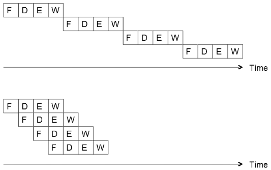

**ideal vs practical pipeline:**
1. identical ops vs some stages idle for some ops (external fragmentation), *e.g.* adder during memory op
2. independent ops vs need to detect & resolve inter-ops dependencies
3. uniform subops vs some stages too fast but common clock cycle time (internal fragmentation)

**dependency types:**
1. **data:** current instruction needs previous output, flow dependence true data dependence (depends on value), other two due to lack of register IDs in ISA
   1. **flow:** read after write
   2. **output:** write after write
   3. **anti:** write after read
2. **control:** next instruction known once branch evaluated, special case of data dependence on `PC` register
3. **structural:** resource conflict, *e.g.* data & instruction same bus  

**detecting dependencies:** 
1. **scoreboarding:** each register has valid flag, if `flag = 0` register will be written by some other instruction, check operand valid flags at decode stage
2. **combinational dependence check logic:** check if any stage after decode will write to source register of current instruction being decoded

**resolving data dependencies:** 
1. **freezing:** pipeline stalled till dependency resolved
2. **compile-time detection & elimination:** insert `NOP`s (delay) compile time to resolve data dependencies
3. **data forwarding/bypassing:** data needed by consumer instruction can be supplied directly from later stage in pipeline, instead of stalling then reading register

**resolving control dependencies:** 
1. **freezing:** pipeline stalled till branch resolved
2. **prediction:** fetch instruction before branch resolved, flushed instrs misprediction penalty
   1. **predict-taken:** branch taken (*e.g.* loop), branched instruction fetched
   2. **predict-not-taken:** branch not-taken, next sequential instruction fetched
   3. **dynamic prediction:** assumes next branch will be similar to previous branches
3. **delayed branching:** execute instruction that is independent of branch taken or not
4. **loop unrolling:** reduces branches

**static scheduling:** software based, compiler orders instruction then hardware executes them in that order  
**dynamic scheduling:** hardware based, runtime instruction ordering, extra runtime info (*e.g.* memory latency, branch direction)

**multi-cycle execution:** instruction can take different cycles in execute stage, sequential semantics not preserved, *e.g.* if first instruction throws exception but second instruction is already executed

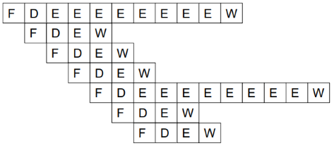

**exception:** cause is internal to running process, handle when detected, *e.g.* divide by 0  
**interrupt:** external to running process, handle when convenient (except high priority ones), *e.g.* mouse input when executable is running

**retired:** instruction finish execution & update arch state (registers, `PC`, memory)

**precise exception/interrupt:** all previous instruction completely retired & no later instruction retired, clean slate beween two instruction, aids software debugging

**handling exception in pipelining:** 
exception causing instruction ready-to-be-retired ⟶ ensure arch state is precise ⟶ flush younger instruction in pipeline ⟶ save `PC` & registers to stack ⟶ redirect to exception routine

**dispatch:** sending instruction to functional unit

**reorder buffer:** complete instruction out-of-order but reorder them before making results visible to arch state, oldest instruction retired first when done & no exception raised (in-order dispatch, out-of-order execution & in-order retirement), helpful for precise exceptions & rollback on mispredictions

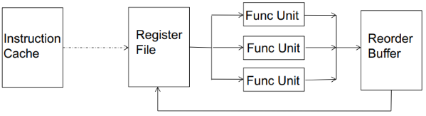

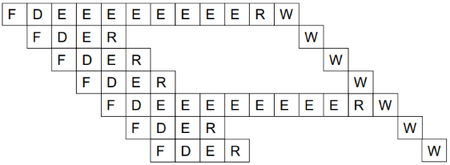

**register renaming:** in case of data dependency, register points to ROB entry that has/will have the output (mapping of register to ROB entry), mapping keeps getting updated, gives illusion that there are large number of registers, so eliminates output & anti dependencies, used to link instruction dependency, when instruction completes it will broadcast ROB value to all dependent instruction

## out-of-order execution

**out-of-order (OoO) execution:** move dependent instruction out of the way of independent ones, fetch & dispatch instruction only when its inputs are ready (similar to dataflow), also known as dynamic scheduling

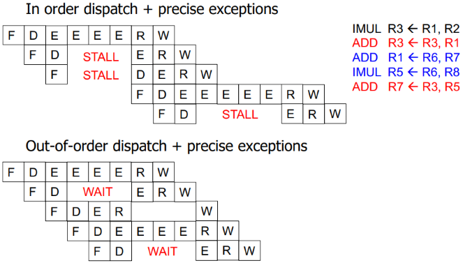

**reservation stations:** rest areas for dependent instruction or waiting for hardware (adder, multiplier)

**register alias table:** table of ISA registers with corresponding "tag" or "value"

**latency tolerance:** allows independent instruction to execute and complete in presence of long-latency operation (like memory access)

**frontend register file:** for register renaming  
**architectural register file:** for maintaining precise state

**OoO execution (tomasulo's algorithm):** 
1. **find operand dependencies:** set `tag` as operand for dependencies (register renaming), else use `value` directly
2. **scheduling:** buffer instruction to reservation stations, each functional unit (adder/multiplier) has its own reservation station
3. **execute when ready:** wait for data/resource dependencies to resolve
4. **dispatch instruction if source values ready:** output "tag" broadcasted when value produced, each instruction compare their source "tags" to broadcasted ones, instruction "wakes up" when source values ready
5. **reorder output:** instruction updates output value in register alias table (frontend register file), instruction added to reorder buffer, architectural register file updated when instruction retires on becoming oldest instruction

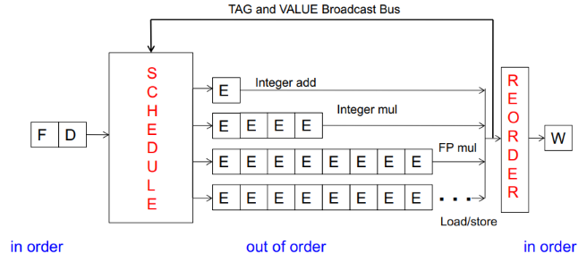

**centralized physical register file:** data values stored in physical registers that reservation stations & register alias table will access, instead of maintaining multiple data copies, alias for physical register added in register alias table, eliminates data broadcast but tag broadcast still needed

**instruction window:** all decoded but not yet retired instruction, OoO dynamically builds dataflow graph of this

**register vs memory:**
1. register known statically vs memory determined dynamically
2. small size vs large
3. register state not visible to other threads vs shared

**memory dependence handling:** memory addr is not known till load/store executes (addr computation needs to finish), determining dependence/independence needs to be handled after load/store partial execution

**memory disambiguation (unknown address) problem:** when load/store has addr ready, there maybe older load/store with undetermined addr (don't know if older instruction will write same memory addr)

**how to detect load-store dependence:** load dependence status is not known till all previous store addr are computed
1. wait until all previous stores committed
2. check whether load address matches with previous store addr stored in store queue (SQ)

**when to schedule load:** 
1. **conservative:** stall load until all previous stores have addr computed, no need for recovery, but delays independent loads unnecessarily
2. **aggressive:** assume load is independent of unknown-addr stores & schedule it, simple & more probable case, but recovery on misprediction
3. **intelligent:** predict if load is dependent on unknown-addr store, more accurate, but still recovery

**store-to-load forwarding:** cannot update memory out of program order, load queue & store queue used, after store execution, addr & data written to SQ (acts as store reorder buffer), later when load calculates its addr
1. searches SQ with addr, for multi-word load - dependence on multiple SQ entries
2. access memory address
3. receive value from youngest older store

**pure data flow:** availability of data determines order of execution, a data flow node fires when sources are ready, too much parallelism (not enough execution units in hardware) and no precise state semantics

## superscalar execution

**superscalar execution:** per cycle multiple instr processed (fetch, decode execute & retire), `N`-wide superscalar means `N` instr per cycle (needs `N` data paths)

**dependency checking:** HW perfoms dependence check between concurrently-fetched instr, vertical axis dependence check (OoO horizontal), *e.g.* expected `IPC == 2` but actual `IPC == 1.2`

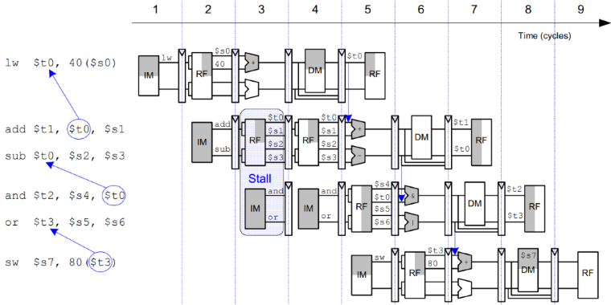

## branch prediction

**control dependence:** if current instruction fetched is control-flow instruction then how to determine next fetch PC

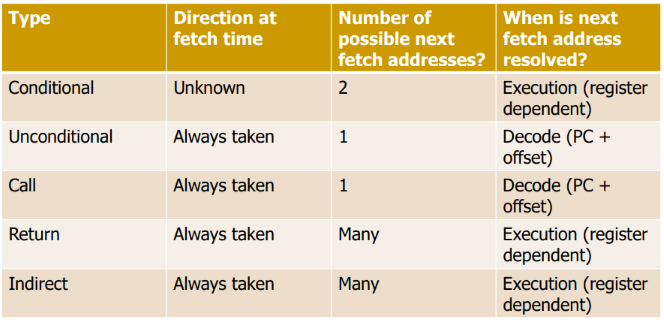

**control dependences handling:** critical to keep pipeline full with correct sequence of dynamic instructions
1. **stall:** the pipeline until next fetch instruction known
2. **branch prediction:** guess next fetch instruction
3. **branch delay slot:** employ delayed branching
4. **fine-grained multithreading:** do something else
5. **predicated execution:** eliminate control-flow instructions
6. **multipath execution:** fetch from both possible paths, need to know the addresses of both possible paths

**branch problem:** next fetch address after a control-flow instruction is not determined after `N` cycles (branch resolution latency) in a pipelined processor, for `W` wide pipeline branch prediction leads to `N × W` wasted instruction slots

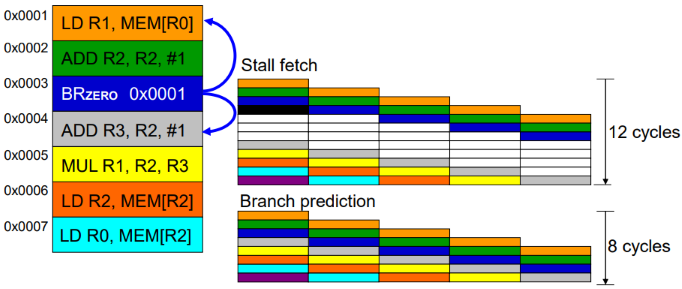

**for better IPC:**
1. reduce branch misprediction penalty(branch resolution latency): resolve branch condition & target address early
2. increase branch probability: branch prediction

**simplest branch prediction:** always predict the next sequential instruction is the next instruction to be execution (`nextPC = PC + 4`), to maximize the chance compiler will lay out the control flow graph such that likely next instruction is on the not-taken path of a branch (`if` instead of `else`), most branches are loops so usually branch not-taken

**branch prediction:** predict the next fetch address (to be used in the next cycle), target address remains same for a conditional direct branch across dynamic instances so store the target address (in branch target buffer/address-cache (BTB)) from a previous instance and access it with the PC
1. **whether fetched instruction is a branch:** if BTB provides a target address for a PC then it must be a branch
2. **conditional branch direction:** prediction schemes used
3. **branch target address (if taken):** BTB stores target address computed last time branch was executed

**branch direction prediction schemes:**
1. **compile time (static):** but cannot adapt to dynamic changes in branch behavior, this can be mitigated by a dynamic compiler (just in time (JIT) compiler) like java
   1. **always not-taken:** simple to implement, no need for BTB, no direction prediction, low accuracy, for better accuracy compiler can layout code such that the likely path is the not-taken path
   2. **always taken:** no direction prediction, better accuracy, backward branch (target address lower than branch PC) like loops are usually taken
   3. **backward taken forward not-taken (BTFN):** for backward branch predict taken and for forward branches not-taken
   4. **profile based:** compiler determines like direction for each branch using a profile run, encodes that direction as a hint bit in the branch instruction format, per branch prediction, accurate only if profile is representative
   5. **program analysis based:** use heuristics (loosely based rules) based on program analysis to determine statically-predicted direction, *e.g.* negative integers used as error values so predict `BLZ` as not-taken, *e.g.* predict a branch guarding a loop execution as taken, heuristic should be representative
   6. **programmer based:** progammer provides the statically-predicted direction using pragmas, programmer may know their program better than other analysis techniques
2. **run time (dynamic):** predict branches based on dynamic information collected at runtime
   1. **one-bit last time predictor:** indicated which direction branch went last time it executed, misprediction when branch changes behaviour, always mispredicts the last & first iteration for loop branches (`N` iterations `accuracy = (N-2)/N`), changes prediction too quickly
   2. **two-bit counter based predictor:** add hysteresis to one-bit predictor so that prediction does not change on a single different outcome, use two bits to track history of predictions, can have 2 states each for taken & not-taken, needs 2 incorrect guesses to change prediction scheme
   3. **global branch history predictor:** recently executed branch outcomes in the execution path are correlated with outcome of the next branch, make a prediction based on the outcome of the branch the last time the same global branch history was encountered, uses two level of history - global history register (GHR) to store direction of last `N` branches and pattern history table (PHT)) to store direction the branch took the last time same history was seen, GHR used as index in PHT, PHT made of two-bit predictors
      1. **gshare predictor:** GHR XORed with branch PC to create PHT index, more context information, better utilization of PHT
   4. **local branch history predictor:** make the prediction based on the outcome of the branch last time same local branch history was encountered, same as global branch history but for same branch
   5. **hybrid branch predictor:** use more than one type of predictor and select best prediction, better accuracy, reduced warmup time (farter-warmup predictor used until the slower-warmup predictor warms up), *e.g.* tournament predictor
   6. **perceptron branch predictor:** perceptron is simple binary classifier (modelled on biological neuron) that learns how each element affects the output, perceptron contains sets of weights, each weight corresponds to a bit in GHR, how much each bit is correlated with direction of the branch, positive correlation large positive weight, negative correlation large negative weight
   7. **history length based predictor:** different branches require different history lengths for better prediction accuracy, have multiple PHTs indexed with GHRs of different history lengths and intelligently allocate PHT entries to different branches

**example: two-bit predictor:**

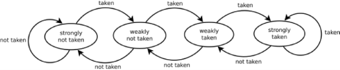

**example: global branch history predictor:**


**example: gshare predictor:**

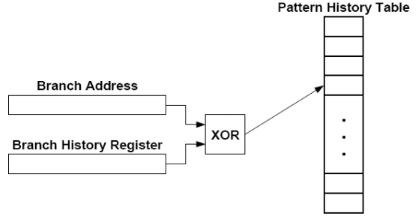

**example: tournament predictor:**

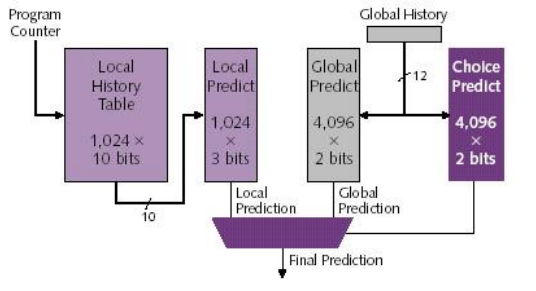

**example: perceptron predictor:**

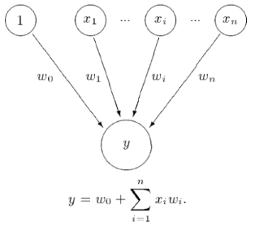
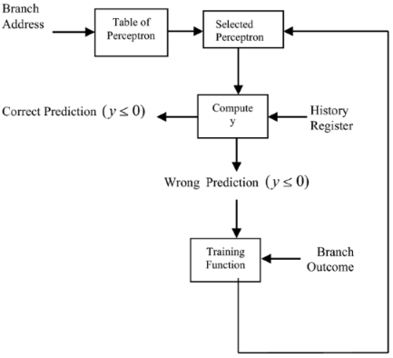

**example: history length based predictor:**

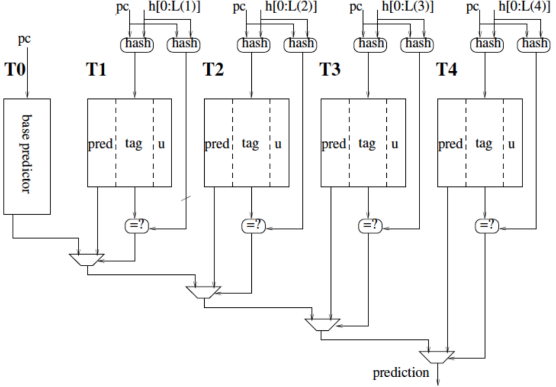

**pragmas:** keywords that enable a programmer to convey hints to lower levels of the transformation hierarchy, *e.g.* `if (likely(x)) { ... }`, *e.g.* `#pragma omp parallel` to direct openmp that loop can be parallelized

**branch confidence estimation:** estimate if the prediction is likely to be correct, useful in deciding how to speculate (*e.g.* whether to stop fetching on this path)

**delayed branching:** delay the execution of a branch, `N` instructions (delay slots) that come after the brnach are always executed regardless of branch direction, branch must be independent of the delay slot instructions, compiler finds delay slot instructions, `NOP` added if delay slot not found

**delayed branching with squashing:** if the branch is not-taken then the delay slot instruction is not executed (instruction squashed), keeps the pipeline full with useful instructions

**predicate combining:** combine predicate operations to feed a single branch instruction instead of having one brancg for each, complex predicates (like `if ((a == b) && (c < d) && (a > 5000))`) are usually converted into multiple branches, single branch checks checks the value of the combined predicate

**predicated execution:** compiler converts control dependence to data dependence, each instruction has predicate bit set based on predicate computation, instruction is effectively a `NOP` if its predicate is false, *e.g.* `if (a == 5) { b = 4; } else { b = 3 }` converted to `CMPEQ condition, a, 5; CMOV condition, b, 4; CMOV !condition, b, 3`, eliminates branches and enables straight line code, avoids misprediction cost but useless work (some instructions fetched/executed but discarded)

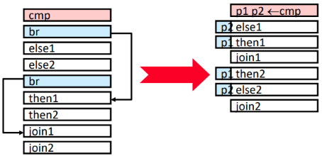

**multipath execution:** execute both paths after a conditional branch, improves performance is misprediction cost greater than useless work, for multiple branches paths followed will become exponential, duplicate work if paths merge (same instructions after branch)

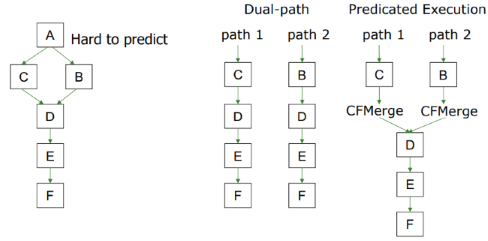

**handling other branch types:**
1. **call:** easy to predict, always taken and single target address, calls marked in BTB and target predicted by BTB
2. **return:** can be called from many points in code (indirect branches), usually return matches a call so use a stack to predict return address (retun address stack), push return (next instruction) address to stack when call fetched, pop stack asnd use the address as its predicted target when return fetched
3. **indirect:** register-indirect branches have multiple targets, two ideas - predict the last resolved target as the next fetch address and use history based target prediction

**branch prediction latency:** need to generate next fetch address for the next cycle, more complex predictors are more accurate but slower

## very-long instruction word

**very-long instruction word (VLIW):** compiler finds independent instructions and statically schedules (packs/bundles) them into a single VLIW instruction to be fetched & executed concurrently, no need for hardware dependency checking between concurrently-fetched instructions (like in superscalar execution), all instructions in a bundle are executed in lockstep, if any operation in the VLIW instruction stalls then all operations stall, if independent instructions not found then `NOP`s inserted, recompilation required when execution width (`N`) or instruction latencies or functional units change

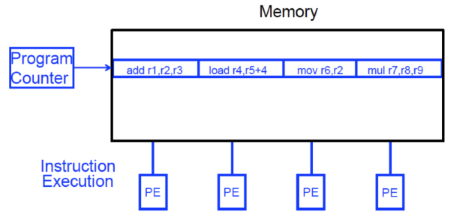

**reduced instruction set computer (RISC):** compiler does the hardwork to translate high-level language code to simpler instructions, VLIW philosophy similar to RISC but compiler does the hardwork to find instruction level parallelism

**explicitly parallel instruction computing (EPIC):** intel's implementation of VLIW, not fully VLIW but based in VLIW principles, instruction bundles can have dependent instructions, a few bits in the instruction format specify explicitly which instructions in the bundle are dependent on which other ones

## fine-grained multithreading

**fine-grained multithreading:** hardware has multiple thread contexts (PC & registers), each cycle fetch engine fetches from a different thread, used to handle data & control dependencies, no instruction fetched from same thread till the fetched branch/instruction is resolved, branch/instruction resolution latency overlapped with execution of other threads' instructions, reduced single thread performance since one instruction fetched every `N` cycles from the same thread, does not overlap latency if not enough threads to cover the whole pipeline

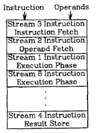

## single instruction multiple data

**flynn's taxonomy of computers:**
1. **single instruction single data (SISD):** single instruction operates on single data element, *e.g.* single core processor
2. **single instruction multiple data (SIMD):** single instruction operates on multiple data elements, *e.g.* array & vector processor
3. **multiple instruction single data (MISD):** multiple instructions operates on single data element, *e.g.* systolic array processor
4. **multiple instruction multiple data (MISD):** multiple instructions operates on multiple data elements, multiple instruction streams, *e.g.* multi-core processor

**data parallelism:** concurrency arises from performing the same operation on different pieces of data, form of instruction level parallelism where instruction happens to be same across data

**contrast to data flow:** concurrency arises from executing different operations in parallel  
**contrast to thread parallelism:** cocurrency arises from executing different threads of control in parallel

**time-space duality:** single instruction operates on multiple data elements in time or in space
1. **array processor:** instruction operates on multiple data elements at the same time using different spaces
2. **vector processor:** instruction operates on multiple data elements in consecutive time steps using the same space, functional units are pipelined

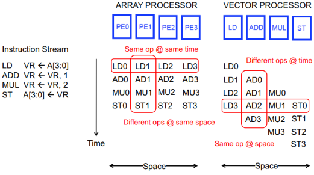

**VLIW vs array processor:** multiple independent operations packed together by compiler vs single operation on multiple different data elements, irregular vs regular parallelism

**regular parallelism:** tasks are similar and have predictable dependencies  
**irregular parallelism:** the tasks are dissimilar in a way that creates unpredictable dependencies

**vector:** one-dimensional array of numbers
**stride:** distance in memory between two elements of a vector

**vector processor:** is one whose instructions operate on vectors rather than scalar (single data) values, requirements are
1. **vector data registers:** to load/store vectors, each holds `N` number of `M`-bit values
2. **vector length register (VLEN):** to operate on vectors of different lengths
3. **vector stride register (VSTR):** elements of a vector might be stored apart from each other in memory, can be used to access non-consecutive elements, *e.g.* with `VSTR == 8` access `A` ⟶ `A+8` ⟶ `A+16` ⟶ `A+24`
4. **vector mask register (VMASK):** indicates which elements of vector to operate on, set bu vector test instructions

**vector instructions allow deeper pipelines:**
1. no intra-vector dependencies
2. no control flow within a vector
3. known stride allows easy address calculation for all elements, enables prefetching into registers/cache/memory

**vector functional units:** use deep pipeline to execute element operations, control of deep pipeline is simple because elements in vector are independent

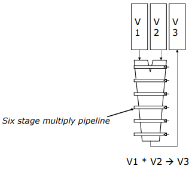

[continue](https://youtu.be/ROpatkOqgjU?list=PL5Q2soXY2Zi_QedyPWtRmFUJ2F8DdYP7l&t=2483)