- [computer vision](#computer-vision)
  - [links](#links)
  - [introduction](#introduction)
  - [filtering](#filtering)
    - [averaging filters](#averaging-filters)
    - [non-linear filters](#non-linear-filters)
    - [derivative filters](#derivative-filters)
  - [feature detection \& matching](#feature-detection--matching)
    - [harris corner detector](#harris-corner-detector)
    - [scale-invariant feature transform](#scale-invariant-feature-transform)

# computer vision

## links

- [homepage](https://pjreddie.com/courses/computer-vision/)
- [lectures](https://www.youtube.com/playlist?list=PLjMXczUzEYcHvw5YYSU92WrY8IwhTuq7p)
- [practical gaussian](https://bartwronski.com/2021/10/31/practical-gaussian-filter-binomial-filter-and-small-sigma-gaussians/)

## introduction

**perspective projection / pinhole model:** 3D mapped to 2D

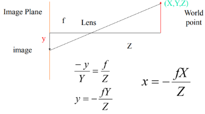

**orthographic projection:** picture taken from far away, example - pictures from drones

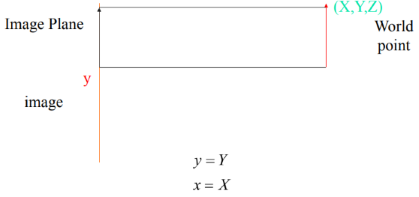

**lambertian model:** 

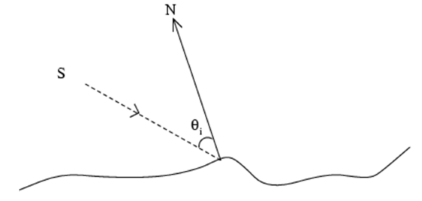  
`S` light source  
`intensity = S · N`

**histogram:** frequency distribution of pixel intensities

**filtering:** changes the pixel values of an image

**warping:** changes the pixel positions of an image, points mapped to other points

## filtering

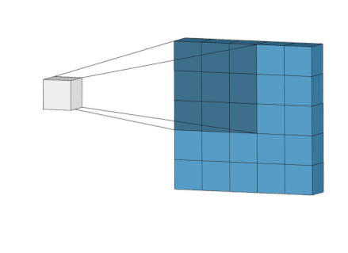

**correlation (`⦻`):** process of moving kernel over the image & computing the sum of products at each location

**convolution (`∗`):** same as correlation but kernel flipped vertically then horizontally or vice-versa (180°), convolution & correlation same for symmetric kernels (like gaussian)

**seperable:** from `n×n` multiplications to `2n`

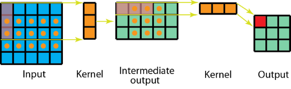

**handling edge pixels:** 
1. **extend:** nearest border pixel extended
2. **wrap:** values taken from opposite edge
3. **mirror:** edges mirrored *i.e.* to read a pixel 3 units outside an edge read one 3 units inside the edge instead
4. **crop:** any pixel which would require values from beyond the edge is skipped
5. **kernel crop:** any pixel in the kernel that extends past the input image isn't used and the normalizing is adjusted to compensate
6. **constant:** use constant value for pixels outside the image

### averaging filters

**averaging filters:** force pixels different to their neighbors (example - noise) to look like neighbors

**mean filter:** average of pixels in window

**weighted mean filter:** weighted average of pixels in window

**gaussian filter:** special case of weighted mean, weights inversely proportional to distance from centre pixel

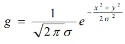

**binomial filter:** fast approximation to gaussian, `[ 1   2   1 ]` approx for gaussian with `σ == 0.85`, filter coefficients from Pascal's triangle

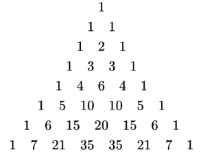

### non-linear filters

**non-linear filters:** cannot be implemented as convolution

**median filter:** assign median of `n×n` kernel as pixel value, to remove extreme outlier noise, edge preserving

**bilateral filter:** extension to gaussian average, remove noise but preserve edges, only average pixels with intensity similar to centre pixel

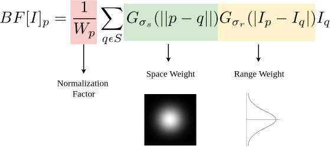

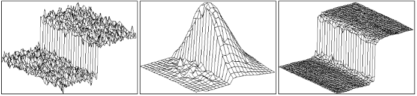

### derivative filters

**derivative:** rate of change, `∆x == 1` in discrete domain
1. **backward difference:** `[-1   1   0 ]`
2. **forward difference:** `[ 0   1  -1 ]`
3. **central difference:** `[-1   0   1 ]`

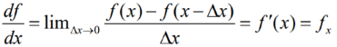


**edge:** intensity/color change, derivative to find discontinuities, for noise reduction average then derivative

**laplacian:** sum of second derivative w.r.t. `x` & w.r.t. `y`, gradient `∇`, laplacian `∆`


**laplacian of gaussian (LoG):**

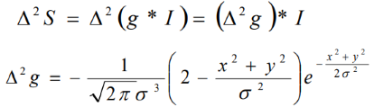

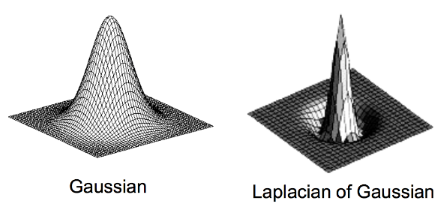

**difference of gaussian:** approximation to LoG, `DoG = g(2σ) - g(σ)`


**zero-crossings:** maxima & minimas become 0 in second derivative
1. `{ +, - }`
2. `{ +, 0, - }`
3. `{ -, + }`
4. `{ -, 0, + }`

**prewitt filter:**
```
mean × central difference

                        [ 1 ]   [-1   0   1 ]
f'(x) = [-1   0   1 ] × [ 1 ] = [-1   0   1 ]
                        [ 1 ]   [-1   0   1 ]
```

**scharr filter:**
```
weighed mean × central difference

                        [ 3  ]   [ -3   0   3  ]
f'(x) = [-1   0   1 ] × [ 10 ] = [-10   0   10 ]
                        [ 3  ]   [ -3   0   3  ]
```

**sobel filter:**
```
gaussian × central difference

                        [ 1 ]   [-1   0   1 ]
f'(x) = [-1   0   1 ] × [ 2 ] = [-2   0   2 ]
                        [ 1 ]   [-1   0   1 ]
```

**marr-hildreth filter:** smooth image using gaussian ⟶ apply laplacian ⟶ find zero-crossings, improved by combining first two steps by using LoG instead of laplacian of smoothened image, edges are given by zero-crossings, edge strength is slope of zero-crossing, example - `slope = | a + b |` for `{ a, -b }`, for seperable kernel `4n` multiplications instead of `n×n`

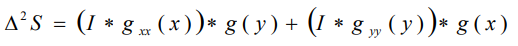


**canny filter:** smooth image with gaussian ⟶ derivate ⟶ compute gradient magnitude & direction ⟶ non-maximum suppression ⟶ hysteresis threshold, improved by combine first two steps by using derivative of gaussian, pixels that are not maximum in the direction of the gradient supressed (non-maximum suppression (NMS)), classify edges into strong & weak edges using two thresholds (hysteresis threshold)
1. **`magnitude > high`:** strong edge
2. **`magnitude < low`:** weak edge
3. **`high > magnitude > low`:** strong edge only if connected to another strong edge pixel directly or via pixel between two thresholds

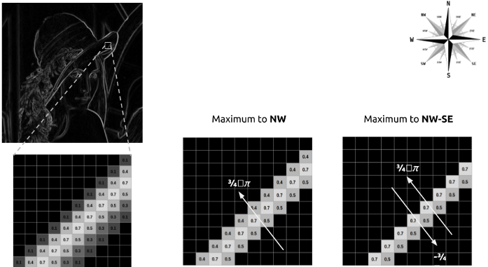


## feature detection & matching

**feature detection & matching:** feature point detection ⟶ extract feature descriptor ⟶ match two descriptors

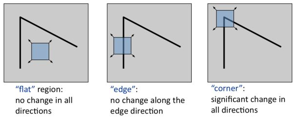

**cross-correlation:** correlate one window with another window, high value if they are similar  
**auto-correlation:** special case of cross-correlation, correlate window with shifted copy of itself

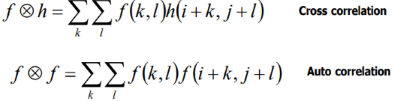

**sum of squared differences (SSD):** similar to correlation, but instead of multiplication take square of difference, low value if they are similar


**SSD & correlation:**

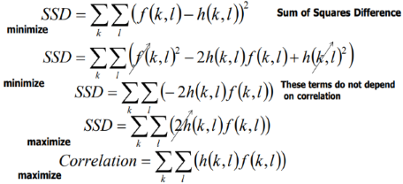

### harris corner detector

**harris corner detector (HCD):** calculate gradient `Ix` & `Iy` ⟶ compute terms in `M` ⟶ calculate `R` ⟶ threshold `R` ⟶ non-maximum suppression

find difference in intensity for a displacement `(u, v)` in all directions

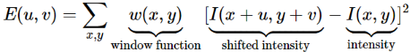

using Taylor Series approximation

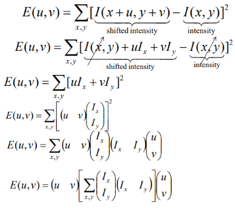

we get

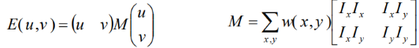

score to determine corner

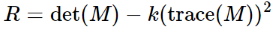

if `λ1` & `λ2` are eigenvalues of `M`, `det(M) = λ1 × λ2`, `trace(M) = λ1 + λ2`

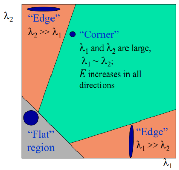
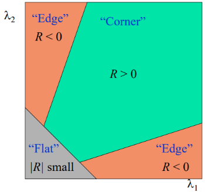

then find pixels with `R` that exceed certain threshold & are local maxima within certain window (to prevent redundant duplicates)

**other variations:**

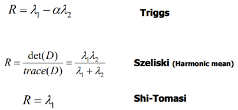


### scale-invariant feature transform

**scale-invariant feature transform (SIFT):** scale space peak selection ⟶ keypoint localization ⟶ orientation assignment ⟶ keypoint descriptor

**scale space peak selection:** local extrema (min/max of 27 pixels) in LoG scale space

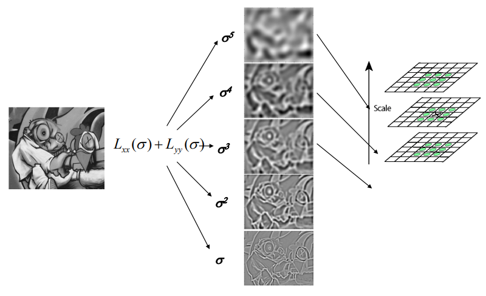