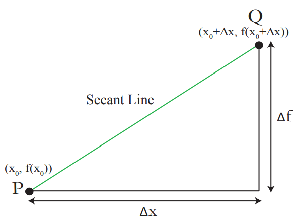

- [single variable calculus](#single-variable-calculus)
  - [derivatives](#derivatives)

# links  <!-- omit from toc -->

- [single variable calculus (MIT, 2007)](https://ocw.mit.edu/courses/18-01-single-variable-calculus-fall-2006/)

# todo  <!-- omit from toc -->

# single variable calculus

## derivatives

derivitive of $f(x)$ at $x_0$ (*i.e.* $f'(x_0)$) is the slope of the tangent line to $y = f(x)$ at $P(y_0, x_0)$ where $y_0 = f(x_0)$

tangent line is the limit of the secant line as the distance between two points goes to zero

derivative is the limit of slopes of of secant lines $PQ$ as $Q \to P$ ($P$ fixed)

**difference quotient:** $\lim_{\Delta x \to 0} \frac{\Delta f}{\Delta x} = \lim_{\Delta x \to 0} \frac{f(x_0 + \Delta x) - f(x_0)}{\Delta x} = f'(x_0)$

- **notations:**
  - **Leibniz:** $\frac{\Delta y}{\Delta x} \to \frac{dy}{dx}$
  - **Newton:** $\frac{\Delta f}{\Delta x} \to f'(x_0)$